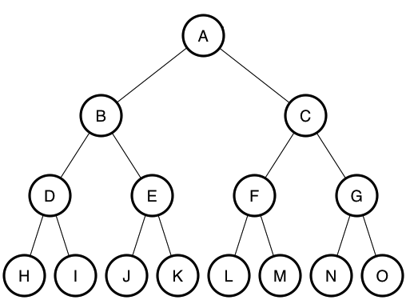

I was curious to use twitter data for a project I had in mind, and basically it was a answering a bunch of question regarding the behavior of users on twitter and how that is correlated with their followers' count. But when I got access to the developer's API, I was lost on how to get the data that I want. 

Of course there are a bunch of packages like Tweepy, Python-twitter, ptt (Python twitter tools) and even Twint (which doesn't require access through Twitter's API) which you can use to get data from twitter, but what kind of data did I want?

What I had in mind was to capture the recent behavior of a random group of users through mining their tweets, but the Twitter API requires searching by specific queries or hashtags, etc..

What I wanted was a random sample of users that isn't affected by users tweeting about a certain topic, and that's when a thought occurred to me Why don't I select a bunch of seed users, collect their latest tweets and then select a random subset of their friends and followers and do the same?

So this is just randomly traversing over a tree of users branched from a seed user until a certain depth, not unlike a binary search tree. 




We can see an example of a traversed tree from a seed user, where the maximum depth <em>l</em> is 4, while the new users recursed over from a seed user is <em>n</em> is 2, and the tweets to collect is <em>t</em> is 1. If user A is the seed user, then we collect the latest tweet and select 2 random users from his friends and followers, which turned out to be B and C.

Then for each of these users we do the same as user A. This results for a total of <em>n<sup>d</sup></em> users for each layer if the starting layer <em>d</em> is 0, which equals 2<sup>3</sup> + 2<sup>2</sup> + 2<sup>1</sup> + 1 = 15 users and 15 tweets.

```python
def stream_from_users(seed_user, tweets_per_user, users_per_user, depth):
    tweets = collect_tweets(seed_user)
    users = collect_random_users(seed_user)
    if depth < limit_depth:
        for user in random_users:
	    stream_from_users(seed_user, tweets_per_user, users_per_user,
			      depth+1)
```

This code snippet would serve to be the backbone of mining this data. But then I was faced with another question, which package should I use to get the data? and how shall I store it?

What I had in mind was starting with 3 seed users, and then recursing over them for 2 levels down, with 100 users per user and collecting 200 tweets per user (which is the limit of one request per user). So that would result in an estimated 30K users and 6 million tweets, how could I efficiently store this data? 

I thought SQLite was the answer, but it turned out that I couldn't do bulk inserts of up to 200 tweets into a table, where I had to loop over every collected tweet and store it which was pretty inefficient. I ended up using MongoDB, which was extremely useful in that matter, as it enabled bulk inserts of tweets in JSON format directly. 

And then came the next hurdle, using Tweepy or Python-twitter was really easy, but when used for mining tweets they returned Status objects, where each object had a JSON attribute, but weren't the Status object it self wasn't supported for bulk inserts in MongoDB, so I would have had to loop over each object and save it's JSON into the database, just like SQLite. And that's why I used ptt, as it directly returned the tweets in JSON format, enabling bulk inserts.

Now it was just a matter of running the script, and then preparing the data in a format which enables answering the questions the I had in mind, which will be reserved for another post.


Github repo: <https://github.com/ahmedsamirio/twitter-crawler>
