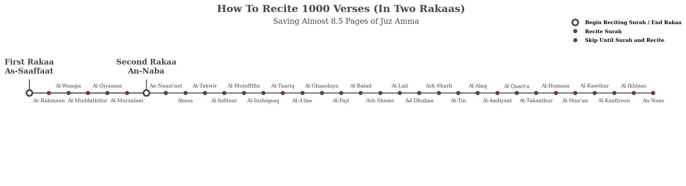
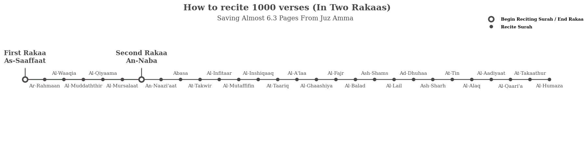
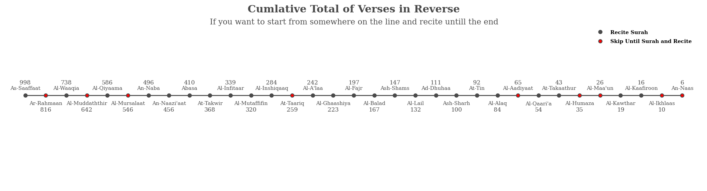
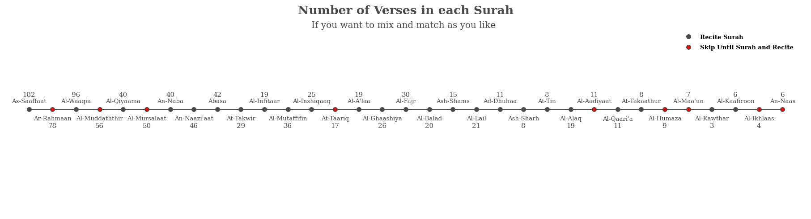

It was the end of Ramadan when I began thinking about how I shall address the habit of night prayers (qiyyam) after the holy month, and thinking to myself that I should specifiy a daily goal (werd). And then I remembered the hadith:

قال الرسول عليه الصلاة و السلام (من قامَ بعشرِ آياتٍ لم يُكتب منَ الغافلينَ، ومن قامَ بمائةِ آيةٍ كتبَ منَ القانتينَ، ومن قامَ بألفِ آيةٍ كتبَ منَ المقنطرينَ) الراوي: عبدالله بن عمرو   
  المحدث: الألباني
  
  المصدر: صحيح أبي داود 1398   
  خلاصة حكم المحدث: صحيح  

The Prophet (peace be upon him) said: If anyone prays at night reciting regularly ten verses, he will not be recorded among the negligent; if anyone prays at night and recites a hundred verses, he will be recorded among those who are obedient to Allah; and if anyone prays at night reciting one thousand verses, he will be recorded among those who receive huge rewards. 

So then I contemplated how could one recite 1000 verses? I don't remember any time during Ramadan where I could have reached that number. I talked about it with my wife and she said that she knew that this was possible, it was by reading the last two Juz's of Quran that you would be able to finish the 1000 verses.

I thought that it was interesting, but I then remembered that I was a budding data scientist, and that I could easily answer this in a data-driven way. I challenged myself to find an easier way than this.

So this project is split into 4 parts:
1. Getting the data and processing it
2. Analyzing the data
3. Illustrating how to pray using either ways
4. Other Scenarios

# Getting the data

I found this amazing github repo called [quran-json](https://github.com/risan/quran-json) which has quran text in JSON format, making it really easy to get the data that I had in mind.

The information that I wanted was all surahs, their total verses, words and characters. That's why I downloaded a json file providing general info about each surah (it's number, name, translation , revelation place and total verses)

```python
url = 'https://unpkg.com/quran-json@latest/json/surahs.pretty.json'
response = urllib.request.urlopen(url)
data = json.loads(response.read())
surahs = pd.DataFrame(data)
```


```python
url = 'https://unpkg.com/quran-json@latest/json/quran/text.pretty.json'
response = urllib.request.urlopen(url)
data = json.loads(response.read())
text = pd.DataFrame(data)
```


After aggregating the information that I needed, I set out to find the answer. In order to find the easiest way to pray with 1000 verses, I needed to find which surahs have the easiest verses to read, that is they contain the least amount of words or characters per verse.

The basic idea that I had was to rank the Surahs according to their word to verse, or char to verse ratio. After that I could figure out the cutoff point where the cumlative sum of the Surahs' verses reaches 1000, then sort them according to their number in the Quran to find out how to read them.

But first we need to look at the baseline, in order to compare it with the new ways we are trying to find. And I summarized it into the following:

Total number of Surahs: 48  
Total number of Verses: 995  
Total number of Words: 5161  
Total number of Characters: 23161  

Since we read Al-Fatihah at least one time in Qiyyam (In a one rakaa' wetr prayer), that would decrease 14 verses from the total 1000 verses. Meaning the we don't more than 993 verses to complete 1000 verses including the verses of Al-Fatihah.

Now that we have our baseline, let's take a look into what the data dictates.


We can see the word to verse ratio in all Surahs is bimodal. We can see that the a great proportion of the Surahs have low word to verse ratio. So how many of them would it take to complete 1000 verses if I we ranked the Surahs by word to verse in ascending order?


So using this information, we know that it would take 34 surahs to complete 1000 verses. But Surahs in here are sorted by the word to verse ratio, how would we actually read them if they were sorted by their number?


So by following this you wouldn't start at Al-Mulk, but rather at As-Saaffaat, and then skipping to Ar-Rahmaan and Al-Waaqia, then skip to Al-Muddaththir and recite until the end while skipping some Surahs that have high word to verse ratio.

Summarizing this way like the old way would yield us:
Total number of Surahs: 34  
Total number of Verses: 1005  
Total number of Words: 4272  
Total number of Characters: 19764  

Word count difference with Baseline: 889  
Character count difference with Baseline: 3397  

To better understand how does this difference fair out, let's find out how many pages of Juz' Amma (جزء عم) this way cuts out.

```python
juz_amma = surahs.query('number >= 78')
page_word_count = juz_amma.total_words.sum() / 23
words_saved = data_old.total_words.sum() - first_way.total_words.sum()
pages_saved = words_saved/page_word_count
```

And it turns out that the number of pages from Juz Amma this way saves is 8.325325732899023. But this bothered me, as I didn't want to be always on the lookout for Surahs I was going to skip, whereas the old way provided a slick way to just go through the last two Juz's, was there a way to find a middle ground?

I figured out that I should stick with the most important part, which are the parts that finish the bulk of the verses. The first 3 Surahs (As-Saaffaat, Ar-Rahmaan and Al-Waaqia) completed 356 verses, which is around 35% of the way. If we recited them and started reciting without any skips from Al-Muddaththir, when could we get the 1000 verses?


Total number of Surahs: 29  
Total number of Verses: 1006  
Total number of Words: 4495  
Total number of Characters: 20831  

Word count difference with Baseline: 666  
Character count difference with Baseline: 2330  

he number of pages from Juz Amma this way saves is 6.236970684039088

By comparing the character difference to Surahs char count, we find that the difference between the baseline in the new way which is similar in simplicity to it is around 6.25 pages of Juz' Amma. 

Now there are 2 choices for, so you either go with the easiest way to read 1000 verses which saves you around 8.25 pages, or you go with a still easy way that saves you 6.25 pages, or you go with the old way by reading the two Juz's back to back.


This question wasn't intended as a call for laziness, afterall if you intended to pray with 1000 verses how dare anyone call you lazy, but it's a way to decrease any deterrents or obstacles between intending it and actually achieving it.

# How would you pray 2, 4 or 8 Rakaas using the easiest way?

I've illustrated how you would do that exactly in the next plots




# How would you pray 2, 4 or 8 Rakaas using the second easiest way?




Now you might have started reading somewhere else, and you want to continue reciting a specific number of verses, but you are still looking for an easy way to do it. That's why I've the following charts.







Now you have all the tools to recite those 1000 verses, I pray that we're all blessed to be from those who did this.

I hope that this post inspires those who read it to work on projects that they find interesting, and ask questions that can possibly optimize whatever good deeds they maybe doing.


