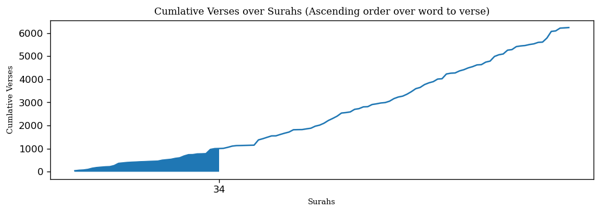

# Introduction

It was the end of Ramadan when I began thinking about how I shall address the habit of night prayers (qiyyam) after the holy month, and thinking to myself that I should specifiy a daily goal (werd). And then I remembered the hadith:

قال الرسول عليه الصلاة و السلام (من قامَ بعشرِ آياتٍ لم يُكتب منَ الغافلينَ، ومن قامَ بمائةِ آيةٍ كتبَ منَ القانتينَ، ومن قامَ بألفِ آيةٍ كتبَ منَ المقنطرينَ)  الراوي: عبدالله بن عمرو | المحدث: الألباني | المصدر: صحيح أبي داود 1398 | خلاصة حكم المحدث: صحيح

The Prophet (peace be upon him) said: If anyone prays at night reciting regularly ten verses, he will not be recorded among the negligent; if anyone prays at night and recites a hundred verses, he will be recorded among those who are obedient to Allah; and if anyone prays at night reciting one thousand verses, he will be recorded among those who receive huge rewards. 

So then I contemplated how could one recite 1000 verses? I don't remember any time during Ramadan where I could have reached that number. I talked about it with my wife and she said that she knew that this was possible, it was by reading the last two Juz's of Quran that you would be able to finish the 1000 verses.

I thought that it was interesting, but I then remembered that I was a budding data scientist, and that I could easily answer this in a data-driven way. I challenged myself to find an easier way than this.

So this project is split into 4 parts:
1. Getting the data and processing it
2. Analyzing the data
3. Illustrating how to pray using either ways
4. Other Scenarios

# Getting the data

I found this amazing github repo called [quran-json](https://github.com/risan/quran-json) which has quran text in JSON format, making it really easy to get the data that I had in mind.

The information that I wanted was all surahs, their total verses, words and characters. That's why I downloaded a json file providing general info about each surah (it's number, name, translation , revelation place and total verses)

```python
url = 'https://unpkg.com/quran-json@latest/json/surahs.pretty.json'
response = urllib.request.urlopen(url)
data = json.loads(response.read())
surahs = pd.DataFrame(data)
```


```python
url = 'https://unpkg.com/quran-json@latest/json/quran/text.pretty.json'
response = urllib.request.urlopen(url)
data = json.loads(response.read())
text = pd.DataFrame(data)
```


After aggregating the information that I needed, I set out to find the answer. In order to find the easiest way to pray with 1000 verses, I needed to find which surahs have the easiest verses to read, that is they contain the least amount of words or characters per verse.

The basic idea that I had was to rank the Surahs according to their word to verse, or char to verse ratio. After that I could figure out the cutoff point where the cumlative sum of the Surahs' verses reaches 1000, then sort them according to their number in the Quran to find out how to read them.

But first we need to look at the baseline, in order to compare it with the new ways we are trying to find. And I summarized it into the following:

Total number of Surahs: 48  
Total number of Verses: 995  
Total number of Words: 5161  
Total number of Characters: 23161  

Since we read Al-Fatihah at least one time in Qiyyam (In a one rakaa' wetr prayer), that would decrease 14 verses from the total 1000 verses. Meaning the we don't more than 993 verses to complete 1000 verses including the verses of Al-Fatihah.

Now that we have our baseline, let's take a look into what the data dictates.


We can see the word to verse ratio in all Surahs is bimodal. We can see that the a great proportion of the Surahs have low word to verse ratio. So how many of them would it take to complete 1000 verses if I we ranked the Surahs by word to verse in ascending order?





