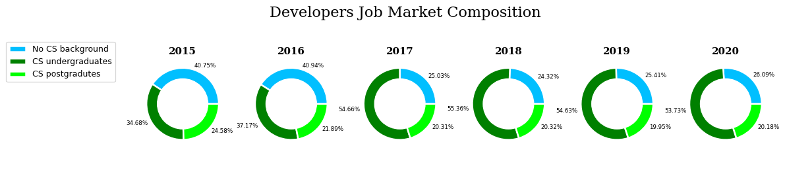
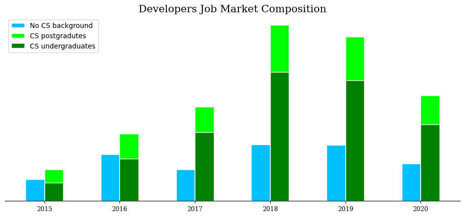

## Motivation

This question always bothers me when contemplating the career-shift I'm attempting to do.

And that's why I started with this question in the first project of Udacity's Data Scientist Nanodegree.

I chose to analyze the StackOverflow data from 2015 until 2020 to answer the question in the title and another 2 questions that also bother me, and they are:
* How present are professional developers with no CS background in the market?
* What non-degree education should a data scientist focus on?
* Is job satisfaction related to salary? or are there other factors?

## How present are professional developers with no CS background in the market?

To my surprise I found out that in the 2015 survey, developers with no CS background constitued about 41% of the respondents.

And this percentage remained the same through 2016, before the sudden drop of 2017.

When I examined why the percentage of professional respondents with no CS background decreased I found out the this was due to a continued increase in the number of CS fresh graduates which you can see in the next bar plot.

