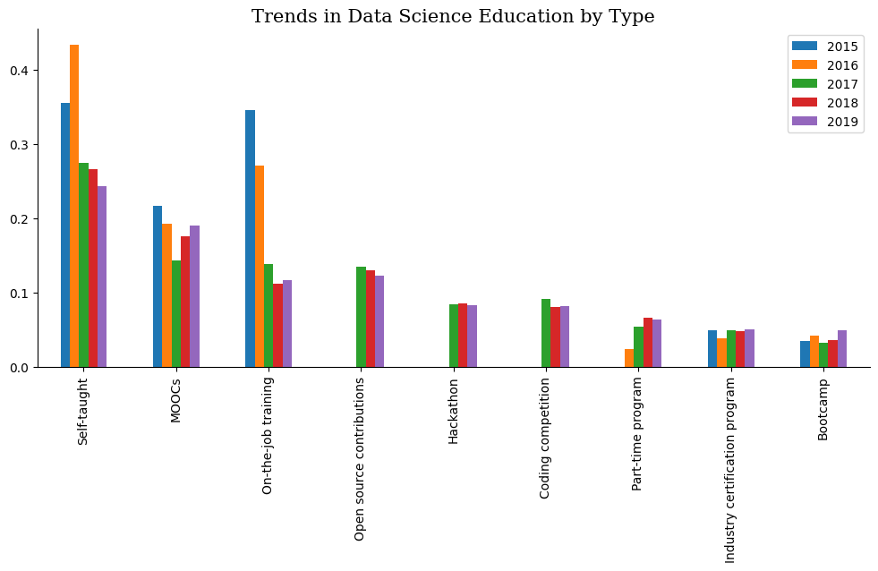
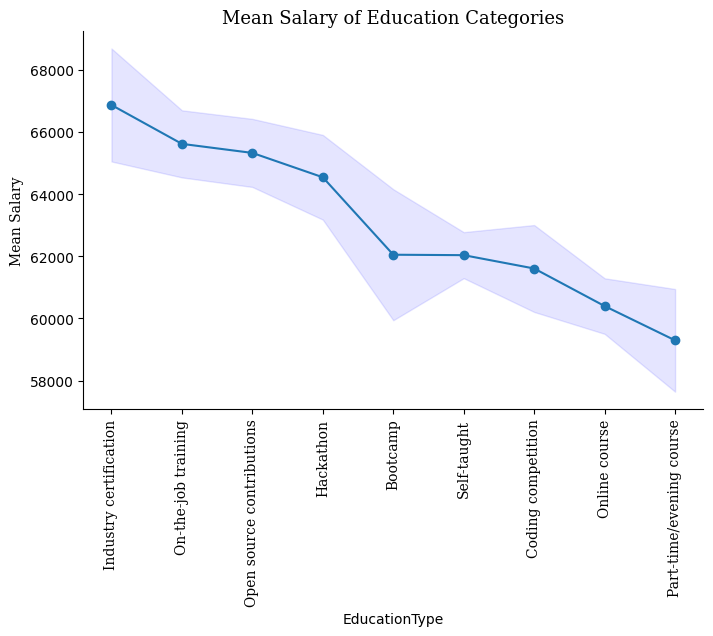
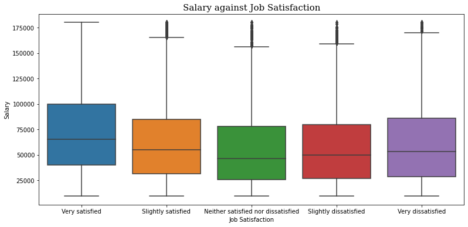
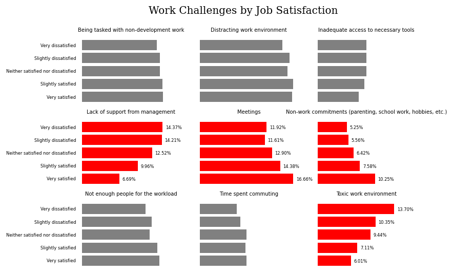

This question always bothers me when contemplating the career-shift I'm attempting to do.

And that's why I started with this question in the first project of Udacity's Data Scientist Nanodegree.

I chose to analyze the StackOverflow data from 2015 until 2020 to answer the question in the title and another 2 questions that also bother me, and they are:
* How present are professional developers with no CS background in the market?
* What non-degree education should a data scientist focus on?
* Is job satisfaction related to salary? or are there other factors?

## How present are professional developers with no CS background in the market?

To my surprise I found out that in the 2015 survey, developers with no CS background constitued about 41% of the respondents.

And this percentage remained the same through 2016, before the sudden drop of 2017.

When I examined why the percentage of professional respondents with no CS background decreased I found out the this was due to a continued increase in the number of CS fresh graduates which you can see in the next bar plot.

Before 2017, the number of professional respondents with no CS background exceeded those with CS background, but we can see the shift that happened in 2017.

The number of CS fresh graduates suddenly increased, and kept increasing through out 2018, but by then the composition of the market stabilised with an average 25% of the professional respondents having no CS background.

So does this mean that it's harder for developer with no CS background to break into the market?

Well, it's not that easy to say from this data, because if the number of CS undergraduates is increasing, that means that there is an increasing demands of developers through new job oppurtunities. 

And if the number of CS developers is increasing, and the number of non CS developers may not be increasing, or increasing but with a much smaller rate when compared to CS developers, then the percentage of non CS developers will remain decreasing in the market.

While it may actually be easier for them to get hired because of the abundance of job oppurtunities that the increasing amounts of CS developers can't even fill.

So the picture might look like it's getting harder, but what is actually happening is that CS developers are just more abundant than before, and non-CS developers are barely increasing.

## What non-degree education should a data scientist focus on?

When I was first introduced to data science, I was torn between the two ways that people suggested for learning.

Some people suggested starting with books, online courses, part-time programs and mainly starting with the theoritical part.

While another groups insisted that the best way to learn data science is by doing, so pick a project to work on or participate in a compeitition in order to have something to show for the skills that companies need.

So first I wanted to look at the trends in data science education.

### Self-education

We can see the previous trends in alternative education dissolve into stable composition through 2017, 2018 and 2019.

Where earlier in 2015 and 2016 the self-taught data scientist was the prevelant one. Maybe that was due to the absence of other means of education, and that's why it's proportion kept decreasing every year with increasing educational sources.

### MOOCs

MOOCs popularity fell down during 2016 and 2017, then it started gaining increasing again through 2018 and 2019. 

### On the job training

It siginificantly fell starting from 2017, and then stablizied. This might indicate a change in how data scientists were hired back then, as the data science sphere had data scientists who didn't need much on the job training to learn how to do their jobs.

### Open source contributions

The stability over the years signify that this method is only relevant to a certain percentage of data scientists who aren't increasing or decreasing in the field, and maybe these are data scientsts who are more heavy on the software engineering side.

### Hackathons and competitions

I originally thought that they would have increasing popularity over the years, but it seems that they are just as stable as open source contributions. 

### Part-time programs, Bootcamps and Industry Certifications

Part-time programs has gained popularity over the years, and that's probably because they became more available, and more reliable. Also bootcamps and industry certifications popularity between respondents has zigzaged throughout the years.

And after that I wanted to understand how does each one relate to salary?

So what I did was aggregate the mean salary for the respondents who said they used each on of the education methods listed in the survey, and this is what I found out.

From the get go we can see online classes and part-time programs are the last in line, which was kind of shocking for me because if we look into the percentage of each education method over the years, we see that the methods with the highest mean salaries aren't that popular. 

First of all we can see the education with the highest mean salary is Bootcamps. We know that bootcamps are expensive, and it makes sense that a developer with a high salary can get into a bootcamp. It might also mean that bootcamps set you up for better oppurtunities. But since there is great uncertainty to where the true mean lies, we can't verify that and it seems to good to be true.

We can see right next to it is on-the-job training, which kind of makes sense as this indicates that data scientists in companies that pay top dollar would recieve training specific to the tools used within the company.

Then we have open source contributions, hackathons and coding competition right next to each other, with slightly decreasing means and slightly increasing uncertainty. This trio definetly speaks of the data scientists practical ability, and if you remember, their trends we going up, which indicates how important they are in determining the kind of job and salary you are going to land. 

What seems interesting is that they are followed by industry certifications, and how uncertainty just increases beyond the last 3 educational methods. I think this speaks of how industry certifications aren't really guranteed to get you a good salary.

And from there we how the remaining educational sources are rated, where self-education, online classes and part-time courses are in the bottom of the list.

So what can we learn from this? I think we can learn that one should focus the practical side more than the theoritical side. 

Proving that you are competent through open source contributions, hackathons, competitions, projects portfolio (which is what you get from a bootcamp) are the way to go.

You should also utilize online and part-time courses, but no the point where they take up all of your time and you don't have anything to show for it.

## Is job satisfaction related to salary? or are there other factors?

I thought that there might be a relationship between salary and job satisfaction, and when I saw the next plot I laughed out loud.

How can the median salary decrease when satisfaction decreases, but then increase when dissatisfaction decreases below neutral?

It paints a different picture of a developer who might have taken a new position at another company, or chosen a career path based on salary alone, and then got to the point of dissatisfaction with the job.

But what are these factors that make a developer dissatified with his job?

What are the challenges that he/she faces?

The percentage of developers facing lack of support from management seems to decrease as satisfaction increases. Which indicates that lack of support from management defines a bad work experience, where the increase in answers from very dissatisfied developers differs from very satisfied by 53.5%.

Very satisfied developers list meetings as one the challenges of work, which means that they are more invloved, and this percentage of developers seeing this as a challenger decreases with decreased satisfaction, which doesn't mean that meetings make employees satisfied per se, but means that dissatisfaction might be related to feeling left out from the work environment.

It also seems that very satisfied developers tend to have more non-work commitments than developers on the other side of the spectrum, with an increase of 49.5%.

Then we have toxic work environment, where very dissatified developers have a 56% increase over very satisfied developers.

What doesn't seem to really matter is being tasked with non-development work, distracting work environment, inadequate access to tools, not enough people for the workload and time spent commuting.

Using these points we can illustrate a mental picture of a satisfied developer:
* They tend to have some sort of competent management, and positive work envrionemnt.
* They tend to have non-work commitments that challenge their work, which indicates that strive to achieve work-life balance.
* They tend to be more involved in their work with their colleagues and other department through meetings, etc..

While unsatisfied developers have the following:
* They tend to distrust management competence
* They might not have good work-life balance, and might be actually overworked
* They are more secluded in their work environment and feel out of the loop

If you contemplate the difference between the two developers listed above, you'll understand why the difference isn't in salary. As the difference is related to the different experiences they both have in the job and their personal life.

## Conclusion

We could sum up the findings in these three points:
* It is still possible to get hire when you have no CS background, but it will be slightly challenging
* In order to learn better as a developer or data scientist, you should give more time to practical education methods 
* Job dissatisfaction isn't related to salary, but it is deeply intertwined between the work environment and your personal life

You can check out the full analysis in [this](https://github.com/ahmedsamirio/stackoverflow-analysis) reposirtory.
