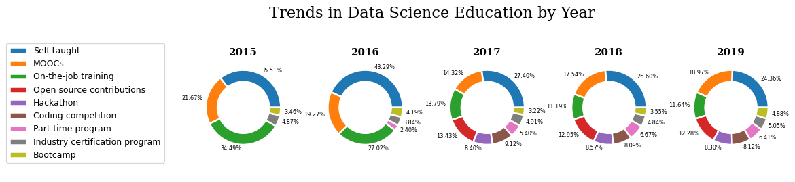
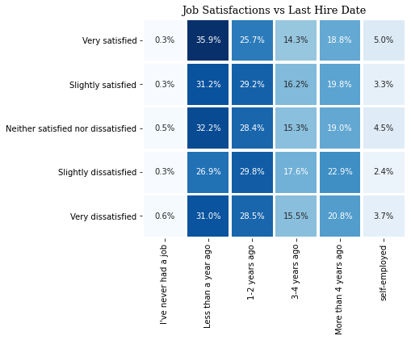
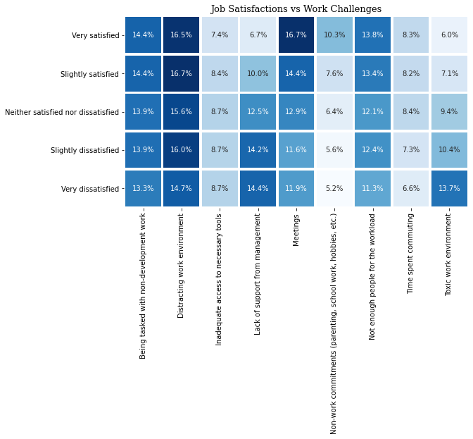

This question always bothers me when contemplating the career-shift I'm attempting to do.

And that's why I started with this question in the first project of Udacity's Data Scientist Nanodegree.

I chose to analyze the StackOverflow data from 2015 until 2020 to answer the question in the title and another 2 questions that also bother me, and they are:
* How present are professional developers with no CS background in the market?
* What non-degree education should a data scientist focus on?
* Is job satisfaction related to salary? or are there other factors?

## How present are professional developers with no CS background in the market?

To my surprise I found out that in the 2015 survey, developers with no CS background constitued about 41% of the respondents.

And this percentage remained the same through 2016, before the sudden drop of 2017.

When I examined why the percentage of professional respondents with no CS background decreased I found out the this was due to a continued increase in the number of CS fresh graduates which you can see in the next bar plot.

Before 2017, the number of professional respondents with no CS background exceeded those with CS background, but we can see the shift that happened in 2017.

The number of CS fresh graduates suddenly increased, and kept increasing through out 2018, but by then the composition of the market stabilised with an average 25% of the professional respondents having no CS background.

So even though it may be harder now than before, it still isn't impossible.

And I think that I accept the challenge to be one of these 25%.

## What non-degree education should a data scientist focus on?

When I was first introduced to data science, I was torn between the two ways that people suggested for learning.

Some people suggested starting with books, online courses, part-time programs and mainly starting with the theoritical part.

While another groups insisted that the best way to learn data science is by doing, so pick a project to work on or participate in a compeitition in order to have something to show for the skills that companies need.

So what I did was aggregate the mean salary for the respondents who said they used each on of the education methods listed in the survey, and this is what I found out.

From the get go we can see online classes and part-time programs are the last in line, which was kind of shocking for me because if we look into the percentage of each education method over the years, we see that the methods with the highest mean salaries aren't that popular. 

Disregarding industry certificates and on-the-job training, we can see that the following methods which surpass online-classes and part-time programs are method which are related to the practical side which exhibits the skills you have.

So we can see that highest payed developers learn through open source contributions, hackathons, competitions, bootcamps (which are heavy on the projects by nature) and educating themselves through projects, documentation and technical books.

The education method with the highest mean salary was industry certificates. For example, if you have an Azure Data Scientist Associate certification, you are technically certified by Microsoft that you can do Data Science on Azure. 

As certificates go they certainly don't gurantee your skill, but to non-technical people like HR this can easily round up your experience and skills.

So it seems that the second group won the argument. But I think that we shouldn't totally disregard online-courses or part-time programs, however we should just give more time to doing to exhibit any skills we learned and are still learning.

## Is job satisfaction related to salary? or are there other factors?

I thought that there might be a relationship between salary and job satisfaction, and when I saw the next plot I laughed out loud.

How can the median salary decrease when satisfaction decreases, but then increase when dissatisfaction decreases below neutral?

I though that maybe some developers were at a certain job for a long time, and hence they have high salaries, but just go fed up from it. So I tried to look for any relationships between dissastifaction and time at a job.

This heatmap is basically vertically stacked barplots for the time at the current job over every satisfaction category, so we want to observe a fading color in the columns from up to down, indicating positive correlation, or a fading from down to up, indicating negative correlation.

And this effect here isn't present in the way expected, so this scenario wasn't true.

So I thought that there maybe some things that developers face in some jobs (even high paying ones) that make them unhappy, so I looked into how every satisfaction group viewed work challenges.

The columns that have the same color basically aren't different between satisfiend and dissatsified developers, but there are some columns which illuminated key differences between the different groups. These difference in terms of importance are:
* Lack of support from management
* Toxic work envrionment
* Non-work commitments
* Meetings

Using these points we can illustrate a mental picture of a satisfied developer:
* They tend to have some sort of competent management, and positive work envrionemnt.
* They tend to have non-work commitments that challenge their work, which indicates that strive to achieve work-life balance.
* They tend to be more involved in their work with their colleagues and other department through meetings, etc..

While unsatisfied developers have the following:
* They tend to distrust management competence
* They might not have good work-life balance, and might be actually overworked
* They are more secluded in their work environment and feel out of the loop

If you contemplate the difference between the two developers listed above, you'll understand why the difference isn't in salary. As the difference is related to the different experiences they both have in the job and their personal life.

## Conclusion

We could sum up the findings in these three points:
* It is still possible to get hire when you have no CS background, but it will be slightly challenging
* In order to learn better as a developer or data scientist, you should give more time to practical education methods 
* Job dissatisfaction isn't related to salary, but it is deeply intertwined between the work environment and your personal life
