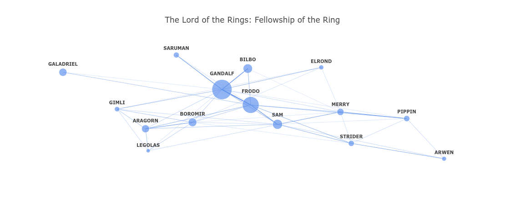
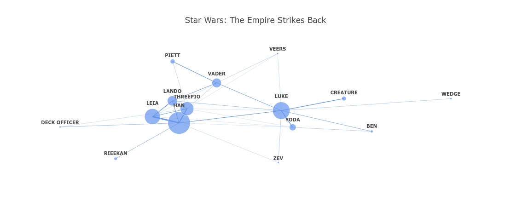
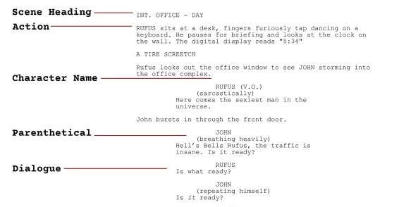
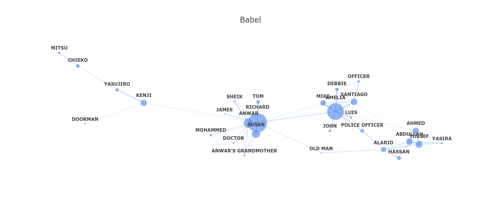
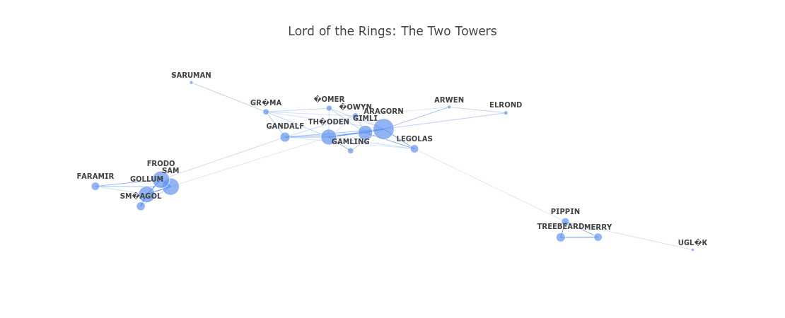
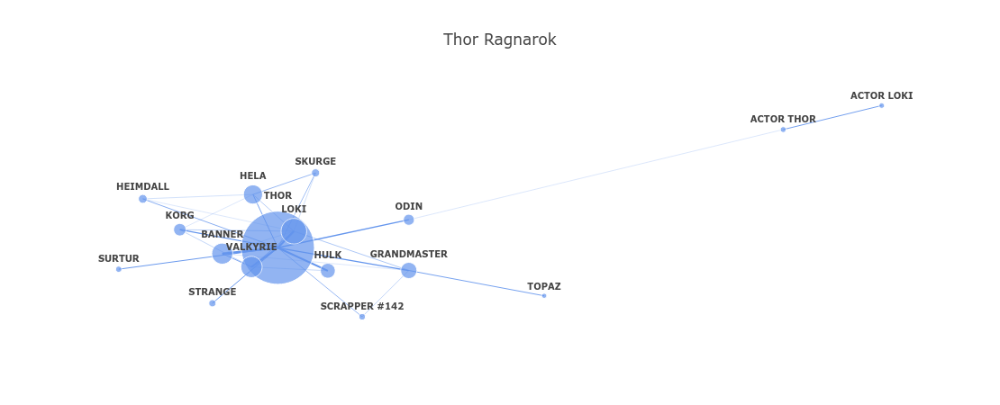

The story of this project starts in the Udacity Data Scientist Nanodegree. The Nanodegree has a simple course about web development using Bootstrap, Flask and JQuery. 

They provided an ungraded project in which you create a dashboard webapp using Flask that fetched data and visualizes it from the WorldBank API.

But I really wanted to do something unique in this project, and I thought that doing the project this way wouldn't teach me anything worthwhile, so I kept digging and digging for ideas that might interest me and have the right mix of challenge and ease that won't get me discouraged.

I had been interested in NLP for a while, but this interest didn't produce any fruitful outcome until now, so I thought that this project should have some NLP in it.

And It finally occurred to me to analyze movie scripts and compare them with each other, specifically of my favorite directors Christopher Nolan and Quentin Tarantino, since they both write their movies' screenplays.

So I started preparing for this project and searching for ways to get the data, and while exploring the things that can be done, the most interesting thing that I found was analyzing the network of interactions between the characters in the script.

A network graph consists of nodes that have various sizes, which are connected by edges. What I had in mind was to make a node for each character with its size varying according to the number of dialogues they have in the script, and to trace the edges between these nodes according to the number of interaction between these characters, and it's illustrated in the following image.


  
  
After successfully making the first network graph, I found that the method could generalize to any script (as all scripts almost have the same anatomy), and so I decided to start a stand-alone project which is a webapp that can show the character network of (almost) any movie. 

The pipeline of the project consisted of the following steps:

1. Getting the data
2. Preparing an app that can make network graphs using movie scripts
3. Deploying the app on the web using heroku
  
  
## Getting the data

This step was really easy as I found [https://imsdb.com/](https://imsdb.com/) which is a database the contains numerous movie scripts in HTML format.  

Using requests and BeautifulSoup I was able to:

1. Fetch and extract all movies relative links in imsdb
2. Loop over the movies and extract their script texts from HTML pages using BeautifulSoup
3. Save the scripts texts and saving a clean version of the movie name for further lookups
  
  
```
  response = requests.get('https://imsdb.com/all-scripts.html')
html = response.text

soup = BeautifulSoup(html, "html.parser")
paragraphs = soup.find_all('p')

movies_files = {}

for p in paragraphs:
    relative_link = p.a['href']
    search_title, save_title, script = get_script(relative_link)
    if not script:
        continue

    # clean save title from any punctuations that prevent creating a filename
    save_title = save_title[:-5].translate(str.maketrans('', '', string.punctuation)) + '.txt'
    script_file = os.path.join(SCRIPTS_DIR, save_title)

    # save script text
    with open(script_file, 'w', encoding='utf-8') as outfile:
        outfile.write(script)

    # save mapping of movie name with script text file
    movies_files[search_title] = script_file

# save mapping to a picke file for easy loading
movies_files_pkl =  open(os.path.join(SCRIPTS_DIR, MOVIES), 'wb')
pickle.dump(movies_files, movies_files_pkl)
```
  
 For more information about cleaning the HTML you can check the github repo.

## Preparing the visualization app

Now this part was the one that interested me the most, how could I extract characters interactions throughout the script? 

I didn't find a perfect answer, but I found one nonetheless.

Let's take a look at the anatomy of a typical script.
  

  
We can see that a character name is distinct as it's always written in uppercase. We can also see that the only part of the script which is also written in uppercase is the scene heading. 

So what if we split the script into sentences, then we looped over them and identified character names, then appended the following dialogue to them.

Using this approach we would be able to identify the dialogue belonging to each character in the script. And that's exactly what I did.

The condition that I found out was most differentiating between scene headings and character names was the presence of dots and dashes in scene headings. So I used a regular expression that checks for the presence in this in the sentence, alongside being in upper case, to judge whether it's a character name or not.
 
```
def extract_dialogues(script_sents):
    """Function to extract dialogues from tokenized script sentences."""
    pattern_compile = re.compile(r'[.,–!:]')
    dialogues = []
    add_dialogue = False
    for sent in script_sents:
        if not (sent.startswith('(') and sent.endswith(')')):
            if add_dialogue:
                if not (sent.strip().isupper() and not pattern_compile.search(sent)):
                    dialogues.append((character, sent))
                add_dialogue = False
            if (sent.strip().isupper() and not pattern_compile.search(sent))\
               and not (sent.strip().startswith('(') and sent.strip().endswith(')')):
                character = sent.strip()
                add_dialogue = True
    return dialogues
 ```
  
  The next part was finding out through this extracted dialogue, who is talking to whom? 

To be honest, I used the most simple approach that crossed my mind, and that was shifting the dialogue between characters one step backward, so this way if X said something followed by Y saying something, you'd get the X said something to Y, and if X said something after Y, you'd get that Y also said something to X.
  
```
  text = open(movie_file, 'r').read()
text = clean_script_text(text)
sents = sent_tokenize_script(text)
dialogue = extract_dialogues(sents)
dialogue_df = pd.DataFrame(dialogue, columns=['character', 'text'])

# Make list of dialogue exchanged
dialogue_df['character_shifted'] = dialogue_df.character.shift(-1)
```
  
But what if a scene ends with X saying something, then another scene starts with Z saying something, wouldn't that mean that we'd get that X said something to Z?

That's true, but it wouldn't matter that much, because if X regularly interacted with Z throughout the whole script, a wrongly attributed interaction between them wouldn't affect the results that much, and if they never interacted, then this wrongfully attributed interaction would be filtered out in the end of the visualization pipeline as we don't want to show extremely rare interactions between characters, even if they were correct.

Also what if a scene ended with X, then another scene started with X? or what if a scene had X say two sentences back to back?

The easy solution to this was to drop any exchange from a character to itself all together, but still count it into their dialogue count as this would affect the sizes of their node in the network visualization.
  
 
```
# extract character pairs
pairs = dialogue_df[['character', 'character_shifted']].values.tolist()[:-1]

# remove dialogues from one character to themselves and sort exchanges
pairs = ['-'.join(sorted(x)) for x in pairs if x[0] != x[1]]
```

Another shortcoming of this method is that it wouldn't capture interaction between multiple characters, since it's a linear approach that depends on which character speaks after another.

I originally had a solution for this which was to extract the scenes in the script, and use the appearances of characters together in scenes as interactions, but I honestly didn't care that much to implement it as the current method yielded nice results.

Another important point was to remove characters which didn't appear much throughout the script, as they cluttered the visualization and made it look bad for no reason.
  
  
```
# top characters lines count
characters_lines = dialogue_df.character.value_counts()
top_characters = characters_lines[characters_lines > 5]

# count exchanges
pairs = pd.Series(pairs).value_counts()
top_pairs = pairs[in_top_characters(pairs.index, top_characters)]
```
  
And now since I had information about the characters, and how many dialogues they have, and the interactions between these characters, I was ready to move on to making the network.

To remind you, a network graph consists of:

1. Nodes
2. Edges the connect nodes

In our case the nodes where the characters, and the size of these nodes was the dialogue count throughout the script. The edges where the interactions between these characters.

I used NetworkX and Plotly to create the graph using network graph. The code in here heavily relied on this [repo](https://github.com/rweng18/midsummer_network).
  
  
```
def make_edge(x, y, text, width):
    '''Creates a scatter trace for the edge between x's and y's with given width

    Parameters
    ----------
    x    : a tuple of the endpoints' x-coordinates in the form, tuple([x0, x1, None])
    
    y    : a tuple of the endpoints' y-coordinates in the form, tuple([y0, y1, None])
    
    width: the width of the line

    Returns
    -------
    An edge trace that goes between x0 and x1 with specified width.
    '''
    return go.Scatter(x=x,
                      y=y,
                      line=dict(width=width,
                                color='cornflowerblue'),
                      hoverinfo='none',
                      text=([text]),
                      mode='lines')


def get_network_traces(top_characters, top_pairs, pair_chars):
    dialogue = nx.Graph()
    
    # add node for each character
    for char, count in top_characters.iteritems():
        if char in pair_chars:
            dialogue.add_node(char, size=count)
        
    # for each dialogue exchange between two character add an edge
    for pair, count in top_pairs.iteritems():
        char1, char2 = pair.split('-')
        dialogue.add_edge(char1, char2, weight=count)
        
    # get positions for nodes
    pos_ = nx.spring_layout(dialogue)
    
    # for each edge make edge trace, append to list
    edge_trace = []
    for edge in dialogue.edges():
        if dialogue.edges()[edge]['weight'] > 0:
            char1 = edge[0]
            char2 = edge[1]

            x0, y0 = pos_[char1]
            x1, y1 = pos_[char2]

            text   = char1 + '--' + char2 + ': ' + str(dialogue.edges()[edge]['weight'])
            trace  = make_edge([x0, x1, None], [y0, y1, None], text,
                               0.1*dialogue.edges()[edge]['weight']**0.5)
            edge_trace.append(trace)
            
    # make a node trace
    node_trace = go.Scatter(x         = [],
                            y         = [],
                            text      = [],
                            textposition = "top center",
                            textfont_size = 10,
                            mode      = 'markers+text',
                            hoverinfo = 'none',
                            marker    = dict(color = [],
                                             size  = [],
                                             line  = None,
                                             reversescale=True
                                            ))
    # For each node in dialogue, get the position and size and add to the node_trace
    for node in dialogue.nodes():
        x, y = pos_[node]
        node_trace['x'] += tuple([x])
        node_trace['y'] += tuple([y])
        node_trace['marker']['color'] += tuple(['cornflowerblue'])
        node_trace['marker']['size'] += tuple([dialogue.nodes()[node]['size']**0.7])
        node_trace['text'] += tuple(['<b>' + node + '</b>'])
        
    return edge_trace, node_trace
```
  
Until I have created an app that can take a movie script and output a network graph that looks like this:

INSET IMAGE

## Deploying the app using heroku

My knowledge about web development in general is really shallow, but using what I've learned in the small course provided by Udacity in the nanodegree and the template for their original project, I was able to hack together a web app that suited my needs.

I wanted the app to have a search bar with autocomplete which you can type the name of a movie in, and it would autocomplete based on the available scripts, with a button that loads the network graph on the same page. 

The webapp is available at [https://movie-character-network.herokuapp.com/](https://movie-character-network.herokuapp.com/)
 
## Final Remarks
  
I didn't care much for design, as the perfect is definitely the enemy of the good here.

I definetly didn't make a perfect application that correctly graphs interactions between characters in any movie script, and actually I didn't aim to, nor do I think that it's possible since there are many variations in any given script that reduces the ability of hard rules to infer such interactions.

That doesn't mean that you can't dissect a single movie script and graph the interactions in a very meticulous way, but it rather restricts any thought that this dissection would generalize to every other script out there, as evident by this web app.

This project is rather a fun way to look into the movies you love and see how they are different from each other using their network graphs, as some movies can have multiple storylines, which can be evident in their networks, like the movie "Babel" or "The Lord of The Rings: The Two Towers"




And some movies can be really centralized around one character like "Thor: Ragnarok".




You can checkout the full code and understand more about deploying the webapp and running it in you environment in the [github repo](https://github.com/ahmedsamirio/movie-character-network).

Thanks for reading.
