First of all, I'm really happy to be writing this blog post as this signals the end of my Data Scientist Nano-degree journey generally, and the capstone project specifically. 

I'd like to thank Udacity for providing us with this amazing dataset, which enabled me to test my abilities and to really learn some things that couldn't be learned through lessons alone.

In this project, I role-played that I was a Data Scientist at Bertelsmann Arvato Analytics, where I was handed over a project where the stakeholder was a mail-order sales company in Germany.

According to britannica, a mail order business is a

 "method of merchandising in which the seller’s offer is made through mass mailing of a circular or catalog or through an advertisement placed in a newspaper or magazine and in which the buyer places an order by mail."

And this stakeholder wanted two things from us:

1. First it wanted to understand which parts of the general population described the core customer base of the company.
2. Second it wanted a model which predicts which individuals are most likely to convert new campaigns.

The datasets that were provided with this project were:

1. A dataset which holds demographic information about the general population in Germany.
2. A dataset which holds demographic information about the customer base of the stakeholder.
3. A dataset which has the demographic information about the individuals involved in their campaigning, and whether they converted or not.

The datasets that we had were more than enough to begin addressing the requests of the stakeholder, but before we got to do these tasks we needed do some:

1. Data Exploration
2. Data Cleaning

## Data Exploration

The datasets that were provided were:

1. `Udacity_AZDIAS_052018.csv`: Demographics data for the general population of Germany; 891 211 persons (rows) x 366 features (columns).
2. `Udacity_CUSTOMERS_052018.csv`: Demographics data for customers of a mail-order company; 191 652 persons (rows) x 369 features (columns).
3. `Udacity_MAILOUT_052018_TRAIN.csv`: Demographics data for individuals who were targets of a marketing campaign; 42 982 persons (rows) x 367 (columns).
4. `Udacity_MAILOUT_052018_TEST.csv`: Demographics data for individuals who were targets of a marketing campaign; 42 833 persons (rows) x 366 (columns).
5. `DIAS Information Levels - Attributes 2017.xlsx`: Information about features in demographic data.
6. `DIAS Attributes - Values 2017.xlsx`: Information about values of each feature in demographic data.

The two main datasets that we were dealing with had a setback, they were both in CSV format, and due to there size, they took a really long time to load (around 25 minutes). 

Another hurdle was that we couldn't just pickle them as the Udacity workspace memory couldn't handle two copies of the two datasets at the same time.

So the first thing I did was to figure out a way to reduce the size of these datasets by manipulating the data-types of their features, and then pickling them. 

```python
read_pickle = False

# csv data path
data_path = '../../data/Term2/capstone/arvato_data/'

# csv files
azdias_csv = 'Udacity_AZDIAS_052018.csv'
customers_csv = 'Udacity_CUSTOMERS_052018.csv'

# csv file paths
azdias_csv_path = os.path.join(data_path, azdias_csv)
customers_csv_path = os.path.join(data_path, customers_csv)

# pickle files
azdias_pickle = 'Udacity_AZDIAS_052018.csv.pandas.pickle'
customers_pickle = 'Udacity_CUSTOMERS_052018.csv.pandas.pickle'

# load pickled datasets if exists
if azdias_pickle in os.listdir() and customers_pickle in os.listdir():
    print("Loading AZDIAS pickle...")
    azdias = pd.read_pickle(azdias_pickle)
    
    print("Loading CUSTOMERS pickle...")
    customers = pd.read_pickle(customers_pickle)
    
    read_pickle = True

# else load csv and save pickles
else:
    print("Loading AZDIAS csv...")
    azdias = pd.read_csv(azdias_csv_path, sep=';')

    print("Loading CUSTOMERS csv...")
    customers = pd.read_csv(customers_csv_path, sep=';')

print("Loading Attributes Sheet...")
dias_atts = pd.read_excel("DIAS Information Levels - Attributes 2017.xlsx")
    
print("Loading Values Sheet...")
dias_vals = pd.read_excel("DIAS Attributes - Values 2017.xlsx")
    
print("Done.")

if not read_pickle:
    azdias_p, azdias_na = reduce_mem_usage(azdias)

if not read_pickle:
    customers_p, customers_na = reduce_mem_usage(customers)

# save datasets in pickle format for later usage
if not read_pickle:
    pd.to_pickle(azdias_p, azdias_pickle)
    pd.to_pickle(customers_p, customers_pickle)
```

Therefore, I significantly decreased their load time (practically made it in seconds instead of almost half an hour), and made it easy to save them in the workspace.

After taking a quick look into the dimensions of the demographic datasets I found the following:

```python
# looking into the general population dataset
print('Shape:', azdias.shape)  # (891221, 366)

# looking into the customers dataset
print('Shape:', customers.shape)  # (191652, 369)
```

366 features were shared between these two datasets, and 3 additional features were present in `CUSTOMERS` relating only to customers which were:

1. `CUSTOMER_GROUP`
2. `PRODUCT_GROUP`
3. `ONLINE_PURCHASE`

Each row in the demographic data represented a single individual, but it also contained aggregated information about their household, their building, their neighborhood, their community, and more aggregations relating to different perspectives.

The thought of trying to understand these 366 features was overwhelming, as it was the first time I have ever tackled a dataset with this size. So I resorted to the sheets provided about the them.

Information about these features were included in `DIAS Information Levels - Attributes 2017.xlsx` and `DIAS Attributes - Values 2017.xlsx`, however after looking into the number of features included in these sheets and the features available in the two demographic datasets, I found some features to be missing from the sheets, and some features in the sheets that were missing from the demographic data.

```python
print("Number of features in Values:", dias_vals.Attribute.dropna().nunique())  # 314
print("Number of features in Attributes:", dias_atts.Attribute.dropna().nunique())  # 313
```

It turned out that the demographic data belonged to 2018, while these sheets belonged to the same data source, but one that was aggregated in 2017.

After taking a look at both sheets I found another thing, despite the dataframe having null values, most features had values in `DIAS Attributes - Values 2017.xlsx` that encoded unknown or missing values. So that urged me to explore missing values in the datasets, which could get me familiar with the data and break the ice between us before delving into each feature individually.

So I made a function that calculates the distribution of null percentages in a dataset in order to enables easy exploration before and after replacing the unknown values with null.

```python
def get_null_prop(df, axis=0, plot=True):
    """Calculates null proportions in dataframe columns or rows."""
    # calculate null proportion of each column or row
    null_prop = (df.isnull().sum(axis=axis) / df.shape[axis]).sort_values()
    if plot:
        null_prop.hist(edgecolor='black', linewidth=1.2)    
    return null_prop
```

```python
azdias_null_cols = get_null_prop(azdias, plot=False)
customers_null_cols = get_null_prop(customers, plot=False)

azdias_null_cols.hist(bins=10, alpha=0.7, label='AZDIAS')
customers_null_cols.hist(bins=10, alpha=0.7, label='CUSTOMERS')
plt.title("Distribution of Null Values in Columns");
plt.legend();
```


```python
azdias_null_rows = get_null_prop(azdias, 1, False)
customers_null_rows = get_null_prop(customers, 1, False)

azdias_null_rows.hist(bins=10, alpha=0.7, label='AZDIAS')
customers_null_rows.hist(bins=10, alpha=0.7, label='CUSTOMERS')
plt.title("Distribution of Null Values in Rows");
plt.legend();
```

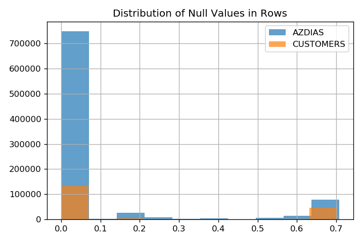

From the above graphs we can see that the null percentages are definitely higher in `AZDIAS` , and since we will be modeling the clustering algorithm on it, we will focus our exploration on it, and only look into `CUSTOMER` if needed.

Then I made a function to replace the unknown values in each features with null, in order to look into the real percentage of missing values in rows and columns.

```python
def replace_unknown_with_null(df):
    """Replace unknown values with null in all features that have that info available."""
    df_new = df.copy()
    feat_unknown_vals = dias_vals.query("Meaning == 'unknown'")

    for feat in feat_unknown_vals.itertuples():
        # check if feature in df
        if feat.Attribute in df_new:
            # if unknown values are more than one
            if ',' in str(feat.Value):
                # loop over unknown values
                for val in str(feat.Value).split(','):
                    # replace unknown value with null
                    df_new.loc[:, feat.Attribute] = df_new.loc[:, feat.Attribute].replace(eval(val), np.nan)
            else:
                # replace unknown value with null
                df_new.loc[:, feat.Attribute] = df_new.loc[:, feat.Attribute].replace(feat.Value, np.nan) 
    return df_new

# replace unknown values with null
azdias_new = replace_unknown_with_null(azdias)
```

After replacing the unknown values with null, I visualized the null percentages in old and new `AZDIAS` in order to understand the consequences of this step.


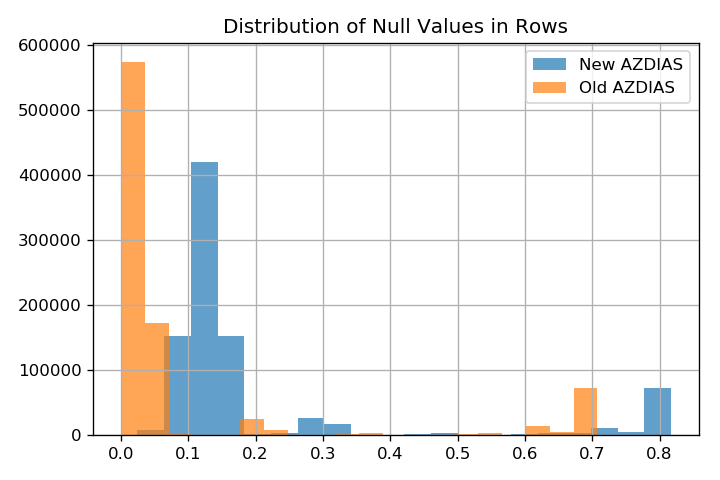

After replacing the unknown values with null, we can see more features having higher percentage of null values than before.

The question then was how to deal with these missing values?

This will depend completely on the type of feature we are dealing with. As missing values can be divided into 3 categories:

1. Missing completely at random (MCAR): where the absence of such data is completely unrelated to other observed data and unobserved data, which means that there is no pattern to the missing data.
2. Missing at random (MAR): where the absence of such data is related to other observed data but not unobserved data, which means that there is a pattern to the missing data.
3. Missing not at random: where the missing data is related to unobserved data and it signifies something, like a column about age of first child while the person related to the data point doesn't have a child.

We have a lot of features, and fortunately `DIAS Information Levels - Attributes 2017.xlsx` had them divided into categories. 

So I decided that the best way is to skim each category's features with their description, value counts and percentage of null values, and take notes along the way.

```python
print("Number of feature categories:", dias_atts["Information level"].nunique())
print("\nFeature Categories:")
print(dias_atts["Information level"].value_counts())

Number of feature categories: 9

Feature Categories:
PLZ8                  112
Microcell (RR3_ID)     54
Person                 42
Household              25
Microcell (RR4_ID)     11
Building                9
RR1_ID                  5
Postcode                3
Community               3
Name: Information level, dtype: int64
```

And so I made a function that let's us inspect the features of each category, and get information about it's description if it was available.

```python
def explore_category(category, azdias):
    """Prints description, null percentage and value counts of each feature in a specified category."""
    # query only features in category
    cat_feats = dias_atts[dias_atts["Information level"] == category]
    # calcualte null percentage of each features
    cat_feats["null_percentage"] = cat_feats["Attribute"].apply(lambda feat: azdias[feat].isna().sum()/azdias.shape[0])
    # sort by null percentage
    cat_feats = cat_feats.sort_values("null_percentage")
    
    print(f"Number of features in {category}: {len(cat_feats)}\n\n")
    for i, row in cat_feats.iterrows():
        feat = row["Attribute"]
        print(feat)
        print(row["Description"])
        print("Null percentage:", row["null_percentage"])
        print(azdias[feat].value_counts())
        print()
```

The output of each feature was similar to this

```python
KBA13_ALTERHALTER_30
share of car owners below 31 within the PLZ8
Null percentage: 0.11871354018812394
3.0    333405
2.0    160653
4.0    147128
1.0     72911
5.0     71324
Name: KBA13_ALTERHALTER_30, dtype: int64
```

Which enabled us to skim the features in a given category easily and write down notes and thoughts about these features.

### PLZ8 Features

According to [https://datarade.ai/data-products/plz8-germany-and-plz8-germany-xxl](https://datarade.ai/data-products/plz8-germany-and-plz8-germany-xxl), Germany has been divided into 84,000 PLZ8 boundaries, so this category contains socio-economic data related to each PLZ8 boundary which helps in optimizing distribution of promotional materials, and in our case the mail-order sales.

By skimming through the results I found that that:

1. All features are ordinal categorical except **KBA13_ANZAHL_PKW**.
2. 105 features have the same null percentage which is 11.87%, while the remaining 7 have 13.07%


This rings the bell for data MCAR or MNAR, as there is a pattern that is most likely unrelated to observed data, but can or can't be related to unobserved data, which is why some persons just don't have PLZ8 data collected.

1. **KBA13_ANZAHL_PKW** is supposed to encode the number of cars in the PLZ8, but it has high values of peculiar number which are 1400, 1500, 1300, etc.

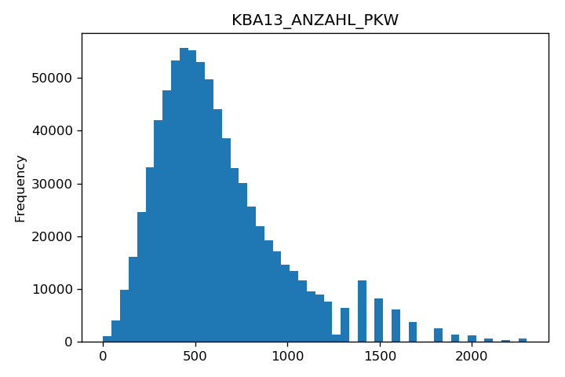

We can see that the bins starts getting less granular is we exceed 1200. My guess is that this data was spread between 1300 and the max values, but the granularity of these section was decreased, which explains why the distribution is right skewed but then we start seeing bumps near the end. 

We could leave it as is, as I don't think it would make much difference. Or we can follow the lead of the last section and reduce the granularity of the whole feature.

### Microcell (RR3_ID) Features

By skimming through the results I can see that:

1. The most prominent null percentage is 16.6%, while a few have less and only has 53.46% which is **KBA05_BAUMAX** (most common building-type within the cell).

### Why is this data missing?

This is data about a collective of individuals, and it should mean that we have any indicator about this collective, like an identifier for the microcell of this person, or the plz8.

I looked for any feature that has the postcode or the PLZ8 area or anything related, but I didn't find one. Therefore I thought that in handling missing data we should do the following:

1. First we should look for rows that have high percentage of missing values across all feature categories
2. We should then drop these rows as we can't use other feature categories to infer them (if we used a method like KNN imputation)
3. We shall then impute the missing values only when the rows are missing from a feature category, but not from the other. That's because the data is extremely related to each other **(we have information about the person, their household, their community, their area, their microcell and their plz8, and all of these are related to each other, so we can use them to infer missing information about each other.)**

### Person Features

Notes about the features:

- **GEBURTSJAHR** (year of birth) has 44% missing values (encoded as 0), which need to be dropped, as we can't infer year of birth, and I don't think it would be that indicative of anything when we have much more deep information about each individual.

```python
GEBURTSJAHR
year of birth
Null percentage: 0.0
0       392318
1967     11183
1965     11090
1966     10933
1970     10883
...
```

- Some features have 0.5% missing values which are mostly related to social status, and it's peculiar why this data is missing about these individuals. If these individuals have more missing data in the other feature categories then we can safely drop them and not worry about their missing data type.
- **PRAEGENDE_JUGENDJAHRE** (dominating movement in the person's youth (avantgarde or mainstream)), **NATIONALITAET_KZ** (nationaltity), **VERS_TYP** (insurance typology), **HEALTH_TYP** (health typology) and **SHOPPER_TYP** (shopping typology) have around 12% missing values.
- **AGER_TYP** (best-ager typology) has 76% missing values, in addition to around 1% of individuals that couldn't be classified (encode as 0).
- **TITEL_KZ** (flag whether this person holds an academic title) has 99% missing values, and it could be just that only 1% hold academic titles and hence the data is correct, and it could be that the data isn't complete and hence we should drop it.

At this point in the exploration, I was curious to find how are the missing values in current features related with the previous categories' ones?

So I determined a threshold for the percentage of missing values in a feature to include this test, and that should be the highest repeating missing values percentage we have seen so far which is 16.6%.

```python
# all features with missing percentage less than 17% and higher than 0%
features_missing = azdias.columns[((azdias_new.isnull().sum() / azdias.shape[0]) < 0.17) &
                                  ((azdias_new.isnull().sum() / azdias.shape[0])) > 0]

# narrow down to only features of the explored categories
plz8_feats = dias_atts[dias_atts["Information level"] == "PLZ8"]["Attribute"].unique()
rr3_feats = dias_atts[dias_atts["Information level"] == "Microcell (RR3_ID)"]["Attribute"].unique()
person_feats = dias_atts[dias_atts["Information level"] == "Person"]["Attribute"].unique()
features_missing = list(set(plz8_feats).union(rr3_feats).union(person_feats).intersection(features_missing))
```

Then I looked into the percentage of rows with 100% missing values.

```python
# azdias with only features that have missing values
azdias_missing = azdias[features_missing]

# flag rows with all missing values
rows_all_missing = azdias_missing.isna().sum(axis=1) == azdias_missing.shape[1]

print("Number of rows with all missing values:", rows_all_missing.sum())
print("Percentage of rows with all missing values:", rows_all_missing.sum()/azdias_missing.shape[0])

Number of rows with all missing values: 7
Percentage of rows with all missing values: 7.854393018117841e-06
```

We can see that there are 7 rows that have all the values for the features explored missing, and we already know that there are rows with high percentage of missing features. **But how many are there exactly?**

```python
rows_missing_p = azdias_missing.isnull().sum(axis=1)/azdias_missing.shape[1]
for i in np.arange(0, 0.8, 0.1):
    print("Percentage of rows with more than {:.2f}% values missing: {}".format(i*100, (rows_missing_p>i).sum()/azdias.shape[0]))

Percentage of rows with more than 0.00% values missing: 0.22381092905126787
Percentage of rows with more than 10.00% values missing: 0.1727225906929931
Percentage of rows with more than 20.00% values missing: 0.17272146863684765
Percentage of rows with more than 30.00% values missing: 0.1315577168850375
Percentage of rows with more than 40.00% values missing: 0.11871690635656026
Percentage of rows with more than 50.00% values missing: 0.11871354018812394
Percentage of rows with more than 60.00% values missing: 0.11799766836732976
Percentage of rows with more than 70.00% values missing: 0.11217980725319533
```

We can see the there is almost 12% of rows that more than 50% missing values. In order to figure out if these rows are problematic here only or overall in the dataset, we can look into the same information using all features in the dataset.

```python
rows_missing_p = azdias_new.isnull().sum(axis=1)/azdias_new.shape[1]
for i in np.arange(0, 0.8, 0.1):
    print("Percentage of rows with more than {:.2f}% values missing: {}".format(i*100, (rows_missing_p>i).sum()/azdias.shape[0]))

Percentage of rows with more than 0.00% values missing: 1.0
Percentage of rows with more than 10.00% values missing: 0.17350802999480489
Percentage of rows with more than 20.00% values missing: 0.14647545333873416
Percentage of rows with more than 30.00% values missing: 0.11872139458114205
Percentage of rows with more than 40.00% values missing: 0.11250408147922905
Percentage of rows with more than 50.00% values missing: 0.11216746463559543
Percentage of rows with more than 60.00% values missing: 0.10454645929573024
Percentage of rows with more than 70.00% values missing: 0.0824902016447099
```

We can see that in the whole the dataset 11.2% of rows have more than 50% missing values. This part of the data seemed problematic, and it suggested that these rows should be dropped. But first I wanted to explore them with relationship to all features that have missing values.

And what I did was this, I look for the percentage of each feature's missing values in these rows compared the total number of missing values available in all rows.

```python
# calculate features missing values
feat_missing_count = azdias_new.isna().sum()

# filter out rows with more than 50% missing values
half_missing_rows = azdias_new[rows_missing_p > 0.5]

# transpose the dataframe to make the features as index
half_missing_rows_t = half_missing_rows.T

# calculate the percentage of null values in these rows for each feature
half_missing_rows_t["null_percentage"] = half_missing_rows_t.isna().sum(axis=1)/feat_missing_count

# sort values by null_percentage
half_missing_rows_t = half_missing_rows_t.sort_values("null_percentage", ascending=False)

# select features that have null values
half_missing_rows_t = half_missing_rows_t.query("null_percentage > 0")

# print each feature, category and percent of missing values
category_missing = defaultdict(list)
category_missing_p = defaultdict(list)
category_missing_count = defaultdict(int)
for feat, p in half_missing_rows_t["null_percentage"].iteritems():
    if feat in set(dias_atts.Attribute):
        category = dias_atts.query("Attribute == @feat")["Information level"].item()
    else:
        category = "Unknown" 
    category_missing_p[category].append(p)
    if p > 0.9:
        category_missing[category].append(feat)
        category_missing_count[category] += 1
    print(feat, category, p)
```

```python
WOHNLAGE Building 1.0
ANZ_TITEL Household 1.0
EINGEFUEGT_AM Unknown 1.0
DSL_FLAG Unknown 1.0
GEBAEUDETYP Building 1.0
AKT_DAT_KL Unknown 1.0
MIN_GEBAEUDEJAHR Building 1.0
MOBI_RASTER Unknown 1.0
OST_WEST_KZ Building 1.0
SOHO_KZ Unknown 1.0
HH_EINKOMMEN_SCORE Household 1.0
UNGLEICHENN_FLAG Unknown 1.0
KBA05_MODTEMP Building 1.0
EINGEZOGENAM_HH_JAHR Unknown 1.0
ANZ_HAUSHALTE_AKTIV Building 1.0
ALTER_HH Household 1.0
ANZ_STATISTISCHE_HAUSHALTE Unknown 1.0
WOHNDAUER_2008 Household 1.0
ANZ_PERSONEN Household 1.0
ANZ_KINDER Unknown 1.0
...
```

```python
for category, p in category_missing_p.items():
    plt.hist(p, alpha=0.5, label=category)
plt.title("Distribution of Null Values Ratio between Data with >= 50% Missing Values and Full Data by Category")
plt.xlabel("Null Ratio")
plt.legend()
```

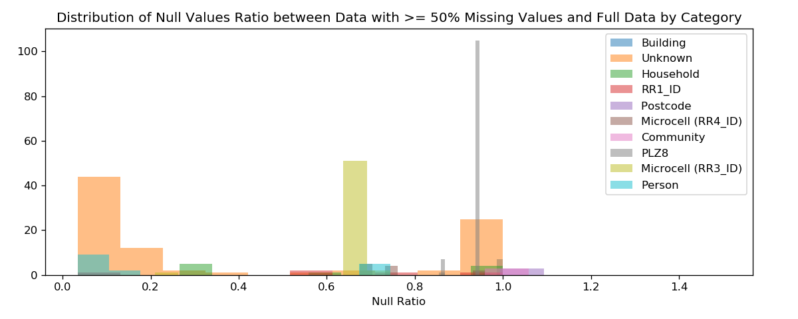

```python
category_mean_p = pd.Series({category: np.mean(p) for category, p in category_missing_p.items()}).sort_values(ascending=False)
category_mean_p.plot(kind="bar", title="Mean Null Values Ratio between Data with >= 50% Missing Values and Full Data");
plt.xlabel("Categories")
plt.ylabel("Mean Null Ratio")
plt.savefig("null_ratio_2.png");
```

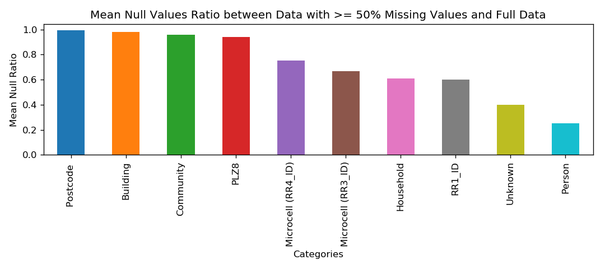

Using these plots we can see that most of the features will benefit from dropping these rows to get rid of most of the missing values in the data, and the rest can be imputed using the method of our choice.

So I asked myself, if I dropped these rows completely, how many features would have more than 90% of their missing values removed?

```python
# first we need to add the original count of Unknown features
original_category_count = dias_atts["Information level"].value_counts()
original_category_count["Unknown"] = len(azdias_feats.difference(dias_atts_feats))
original_category_count = original_category_count.sort_values(ascending=False)

category_half_missing_count = pd.Series(category_missing_count).sort_values(ascending=False)
category_half_missing_count[original_category_count.index].plot(kind="bar", alpha=0.5, color='blue', label="Missing rows")
original_category_count.plot(kind="bar", alpha=0.5, color='green', label="All")
plt.xticks(rotation=90);
plt.legend();
plt.title("Number of Features with More than 90% Missing Values in Rows with More than 50% Missing Values")
```


This graph gives a much clearer picture of what is going on, so let me explain:

- First this graph has the count of features that have more than 90% missing values only in the rows with more than 50% missing values, so it's basically a win-win if we dropped these rows as it will automatically fix the problem of these features missing values, and the rest can be imputed.
- The majority of PLZ8, Building, Postcode and Community features are completely missing in rows with more than 50% missing values so if we drop these rows we won't need to impute them.
- Around 25% of the features with no known category won't need imputation if we dropped rows with more than 50% missing values.
- Some features from Household, RR4 and RR1 categories will be fixed.

**So now that I was satisfied with the results of this detour, I continued exploring the feature in the remaining categories.**

### Household Features

1. **ALTER_HH** (main age within the household) has missing values encoded as 0.
2. **WOHNDAUER_2008** (length of residence) won't need imputation as 100% of missing values are present in the rows that we are dropping.
3. **D19_GESAMT_ONLINE_QUOTE_12** and similar features encode whether a person has no transaction in the previous 12 months, but there are some null values of which only 30% are present in the rows we are going to drop.
4. **W_KEIT_KIND_HH** (likelihood of a child present in this household (can be specified in child age groups)) has 8% missing values of which 60% are in rows that we are dropping.

### Microcell (RR4_ID) Features

1. **CAMEO_DEU_2015** will need one hot encoding and has 11% missing values which should be imputed.
2. **CAMEO_DEUG_2015** is a less detailed CAMEO_DEU_2015 and also has 11% missing values that should be imputed.
3. **KBA05_ANTG1** (number of 1-2 family houses in the cell), **KBA05_ANTG2**, **KBA05_ANTG3** and **KBA05_ANTG4** have 15% missing values of which 74% are present in rows we are going to drop.
4. **KBA05_ANHANG** (share of trailers in the microcell) has 16.5% of which 67% missing values in rows we are going to drop.
5. **KBA05_ALTER1**, **KBA05_ALTER2**, **KBA05_ALTER3** and **KBA05_ALTER4** (share of car owners between X and Y years old) has 16.6% of which 67.4% missing values are in rows we are going to drop.

### Building Features

1. **KONSUMNAEHE** (distance from a building to PoS (Point of Sale)) has 8% missing values that can't be imputed, and fortunately 99% of these missing values are in the rows we are dropping.
2. The rest of the features have 100% of it's missing values in the rows we are dropping, except **KBA05_HERSTTEMP** (Development of the most common car manufacturers in the neighbourhood) which has 85%.

### RR1_ID Features

1. **ONLINE_AFFINITAET** (online affinity) has only 0.5% missing values.
2. **GEBAEUDETYP_RASTER** (industrial areas) has 10.4% missing values of which 99% exist in the rows we are dropping.
3. **MOBI_REGIO** (moving patterns) has 15% missing values of which 74% exist in the rows we are dropping.
4. **KKK** (purchasing power) and **REGIOTYP** (AZ neighbourhood typology) have 17.7% missing values of which 61% exist in the rows we are dropping.

### Postcode Features

1. All features have 10.5% missing values of which 99% exist in the rows that we are dropping.

### Community Features

1. All features have 10.9% missing values of which 95.8% are in rows that we are dropping.

### Unknown Features

Since we have no information about the feature description, I looked through them looking for what they mean and tried to find which features are worth keeping and which are not.

I replaced 0 and -1 values in features with null as I did with other features, however in other features knew that these values were actually missing from `DIAS Attributes - Values 2017.xlsx` , but in this case it was just an assumption based on our knowledge with the data so far.

```python
# find features that don't have categories
no_cat_feats = azdias_new[list(set(azdias_feats).difference(dias_atts_feats))].copy()

# change 0 and -1 to null in non-binary features
for feat in no_cat_feats.columns:
    if no_cat_feats[feat].nunique() > 2:
        no_cat_feats[feat].replace(-1, np.nan, inplace=True)
        no_cat_feats[feat].replace(0, np.nan, inplace=True)
        
# transpose df so that features are index
no_cat_feats = no_cat_feats.T

# calculate null_percentage of features
no_cat_feats["null_percentage"] = no_cat_feats.isna().sum(axis=1)/no_cat_feats.shape[1]

# sort by null percentage
no_cat_feats.sort_values("null_percentage", inplace=True)
```

1. **KOMBIALTER** translates to combial, which I have no idea what it means, but it has no missing values. However, it's values are 1-2-3-4 and then 9, which could mean that 9 is the missing value.
2. **D19_KONSUMTYP_MAX** (D19 CONSUMPTION TYPE MAX) and it also has no missing values.
3. **LNR** has no missing values, and it looks like an individual ID so it should be dropped.
4. **CJT_TYP_(1-5)**, **CJT_KATALOGNUTZER**, **RT_SCHNAEPPCHEN** (RT Bargain) and **RT_KEIN_ANREIZ** (RT No Incentive) have 0.5% missing values which is trivial and I think it is going to be removed with dropped rows.
5. **UNGLEICHENN_FLAG** (Inequality flag) has 8% missing values, and I'm not sure if this feature has missing values encoded as 0 or not, but either way all of it's missing values will be dropped with the rows.
6. **EINGEZOGENAM_HH_JAHR** (RECOVERED HH YEAR) has 8% missing values which will all be dropped with the rows we are dropping, and it encodes information related to year.
7. **SOHO_KZ** has 8% missing values, in addition to a more than 90% 0, and I don't understand what it means.
8. **AKT_DAT_KL**, **VK_DHT4A**, **VK_ZG11** and **VK_DISTANZ**, have 8% missing values, and I couldn't find anything related to it's translation.
9. **RT_UEBERGROESSE** (RT OVER-SIZE) has 8% missing values.
10. **EINGEFUEGT_AM** (INSERTED_AM) is the timestamp of insertion, but which data exactly? It has 10.5% missing values.
11. **DSL_FLAG** and **MOBI_RASTER** have 10.5% missing values with no translation available.
12. **KONSUMZELLE** (Consumer Cell) has 10.5% missing values and only 0-1 values, so I don't understand what does this feature mean exactly.
13. **FIRMENDICHTE** (COMPANY DENSITY) has 10.5% missing values, and I think that all of the featuers so far that have 10.5% missing values come from the same source, which I don't know exactly what it is so far.
14. **ANZ_STATISTISCHE_HAUSHALTE** (ANZ STATISTICAL BUDGETS) has 10.5% missing values. It's distribution seems to be right skewed.
15. **STRUKTURTYP** (STRUCTURE TYPE) has 10.9% missing values.
16. **GEMEINDETYP** (COMMUNITY TYPE) has 10.9% missing values, and it has weird values that don't make sense (not ordinal or nominal). I could further investigate if it has any relation with other community level features.
17. **UMFELD_JUNG** (ENVIRONMENT YOUNG) and **UMFELD_ALT** (ENVIRONMENT OLD) has 10.9% missing values.
18. **CAMEO_INTL_2015** CAMEO is a consumer segmentation system linking address information to demographic, lifestyle and socio-economic insight. We could use KNN imputation to predict the missing values in CAMEO features since they are related to demographic data.
19. All **KB18** features are PLZ8 features.
20. **D19_LETZTER_KAUF_BRANCHE** (D19 LAST PURCHASE SECTOR) has 28% missing values, and I think that it has valuable information, so it shouldn't be dropped with other D19 features.
21. **ALTERSKATEGORIE FEIN** (AGE CATEGORY FINE) has 34% missing values (which are 0), and we know that they are missing because category 1 only has one data point, and 0 has 41188.
22. The rest of the features have more than 50% missing values, so I'm going to drop them except **ANZ_KINDER** (probably the number of children), **ALTER_KINDX** (age of Xth child), as I understand their meaning and know that there missing values are not missing at random.

## Data Cleaning

After the previous exploration, I was able to make some final decisions about how to clean the data for the tasks at hand.

### Steps

1. Clean columns with mixed types
2. Drop columns with more than 50% missing values
3. Replace encoded unknown values with null from Values sheet and
    1. Replace **ALTER_HH** 0 to null
    2. Replace **KOMBIALTER** 9 to null
4. Features to drop:
    1. **GEBURTSJAHR** (year of birth) has 44% missing values
    2. **AGER_TYP** (best-ager typology) has 76% missing values
    3. **CAMEO_DEU_2015** as it is categorical and needs one-hot-encoding while **CAMEO_DEUG_2015** is ordinal and can be better used with PCA.
    4. **LNR** as it is an individual identifier
    5. All features with more than 50% missing values
5. Feature engineering:
    1. **D19_LETZTER_KAUF_BRANCHE** need one hot encoding
    2. **MIN_GEBAEUDEJAHR** should be changed to number of years between 2017 and date
    3. **EINGEFUEGT_AM** should be changed to time between 2017 and timestamp
    4. Change **ALTER_KINDX** and **ANZ_KINDER** null values to 0
    5. Convert **OST_WEST_KZ** to binary labels
    6. Convert **CAMEO_INTL_2015** and **CAMEO_DEUG_2015** to int
6. Impute missing values

## Uncertainties

1. **KBA13_ANZAHL_PKW** is supposed to encode the number
of cars in the PLZ8, but it has high values of peculiar number which are 1400, 1500, 1300, etc. but I'll keep it.
2. **KONSUMZELLE** (Consumer Cell) has 10.5% missing
values and only 0-1 values, where 99% of these missing values will be
dropped with rows we are dropping first. I don't understand what does
this feature mean exactly. but I'll keep it.
3. **GEMEINDETYP** (COMMUNITY TYPE) has 10.9% missing
values, and it has weird values that don't make sense (not ordinal or
nominal), so I'll drop it.
4. **RT_UEBERGROESSE** (RT OVER-SIZE) has small percentage of values encoded as 0, which I don't know if they are missing or not. 89% of it's missing values will be dropped with rows, so I'll keep it.

```python
def clean_dataset(df, p_row=0.5, p_col=0.5, drop_uncertain=True, keep_features=[]):
    """
    Clean dataset using insights gained during EDA.
    
    inputs
    
    1. df (pandas dataframe)
    2. p_thresh (float)  -  maximum threshold of null values in columns
    3. drop_uncertain (bool)  -  drop features we are uncertain from
    """
    # Make a new copy of the dataframe
    clean_df = df.copy()
    
    # Clean columns with mixed dtypes
    clean_df["CAMEO_DEUG_2015"].replace('X', np.nan, inplace=True)
    clean_df["CAMEO_INTL_2015"].replace('XX', np.nan, inplace=True)
    
    # Replace unknown values with missing
    clean_df = replace_unknown_with_null(clean_df)   

    # Drop rows with more than 50% missing values
    min_count = int(((1 - p_row))*clean_df.shape[1] + 1)
    clean_df.dropna(axis=0, thresh=min_count, inplace=True)
    
    # Drop duplicated rows
    clean_df.drop_duplicates(inplace=True)
       
    # Drop GEBURTSJAHR (year of birth) that has 44% missing values 
    clean_df.drop('GEBURTSJAHR', axis=1, inplace=True)
      
    # Drop LNR which is a unique indentifier
    clean_df.drop('LNR', axis=1, inplace=True)
    
    # Drop CAMEO_DEU_2015 as it's not suitable for PCA
    clean_df.drop('CAMEO_DEU_2015', axis=1, inplace=True)
    
    # Drop features with more than p_thresh missing values
    features_missing_p = clean_df.isna().sum() / clean_df.shape[0]
    features_above_p_thresh = clean_df.columns[features_missing_p > p_col]
    
    features_to_keep = ["ALTER_KIND1", "ALTER_KIND2", "ALTER_KIND3", "ALTER_KIND4", "ANZ_KINDER"] + keep_features
    features_to_remove = [feat for feat in features_above_p_thresh if feat not in features_to_keep]
    
    clean_df.drop(features_to_remove, axis=1, inplace=True)
    
    # Drop uncertain features
    if drop_uncertain:
        uncertain_features = ["GEMEINDETYP"]
        clean_df.drop(uncertain_features, axis=1, inplace=True)
        
    # Feature Engineering
    # One Hot Encoding D19_LETZTER_KAUF_BRANCHE
    dummies = pd.get_dummies(clean_df["D19_LETZTER_KAUF_BRANCHE"], prefix="D19_LETZTER_KAUF_BRANCHE")
    clean_df = pd.concat([clean_df, dummies], axis=1)
    clean_df.drop("D19_LETZTER_KAUF_BRANCHE", axis=1, inplace=True)
    
    # Calculate year difference in MIN_GEBAEUDEJAHR
    clean_df["MIN_GEBAEUDEJAHR_ENG"] = (2017 - clean_df["MIN_GEBAEUDEJAHR"])
    clean_df.drop("MIN_GEBAEUDEJAHR", axis=1, inplace=True)
    
    # Calculate days difference in EINGEFUEGT_AM
    current = datetime.strptime("2017-01-01", "%Y-%m-%d")
    clean_df["EINGEFUEGT_AM_DAY"] = (current - pd.to_datetime(clean_df["EINGEFUEGT_AM"])).dt.days
    clean_df.drop("EINGEFUEGT_AM", axis=1, inplace=True)
    
    # Replace null values in ALTER_KIND and ANZ_KINDER with 0 to avoid imputation
    for feat in clean_df.columns[clean_df.columns.str.startswith("ALTER_KIND")]:
        clean_df[feat].replace(np.nan, 0, inplace=True)
    clean_df["ANZ_KINDER"].replace(np.nan, 0, inplace=True)
    
    # Convert OST_WEST_KZ to binary labels
    clean_df["OST_WEST_KZ"] = (clean_df["OST_WEST_KZ"] == "W").astype(np.uint8)
    
    # Convert CAMEO_INTL_2015 and CAMEO_DEUG_2015 to float32
    CAMEO_feats = ["CAMEO_INTL_2015", "CAMEO_DEUG_2015"]
    clean_df[CAMEO_feats] = clean_df[CAMEO_feats].astype(np.float32)

    # Convert float16 features to float32 to enable arithmetic operations
    float_feats = clean_df.select_dtypes(np.float16).columns
    clean_df[float_feats] = clean_df[float_feats].astype(np.float32)
    
    return clean_df
```

The last step remaining was imputing the data after this cleaning pipeline, so I checked the percentage of missing values in features after it.


We can see now that imputations won't be a big deal, and that there is very small number of features that exceed 10% missing values.

### But how shall we impute that data? There are multiple ways we could that including:

1. Imputing missing values with 0 or -1 which was used originally in the dataset
2. Imputing missing values with mean, median or mode and adding and indicator (or not) for missing data
3. KNN imputation
4. Iterative imputation using linear regression

My gut feeling says that I should go with KNN imputation, as I think that features of the same category could be of huge aid in determining which value to impute with, instead of imputing with 0 or mode (since we are dealing with ordinal data).

But KNN imputation will be time and memory intensive, so we can't do on all features. So we probably should stick with an easy strategy like mode imputation for features below a threshold and KNN for features above.

### But what that shall that threshold be?

Since KNN is memory and time intensive, we need the majority of features to be imputed using mode values, and only small number of features shall be imputed using KNN.

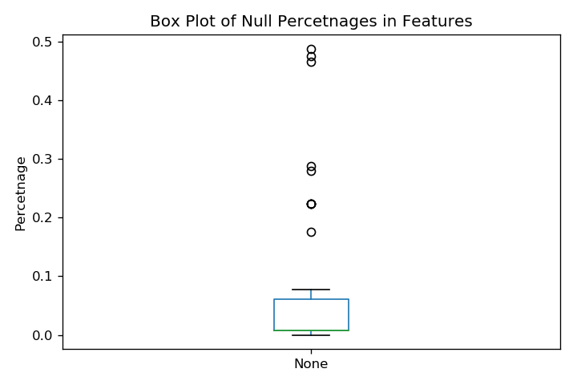

Using this box plot we can see that we can only impute features above 10% using KNN. So in order to do that we need to first impute features lower than 10% using mode imputation, then impute the rest of the features using KNN.

### After several trials, it seemed that KNN takes a really long time.

So instead, I imputed the remaining 10 features using mean imputation to avoid introducing any spike in the data since we are dealing with features that might have more than 20% missing values.

I have used sklearn's ColumnTransformer to impute each set of features using their specified method.

```python
# Features below 10% null percentage
features_below_10 = na_features[na_features < 0.1].index

# Features above 10% null percentage
features_above_10 = na_features[na_features > 0.1].index

imputer = ColumnTransformer([
    ('mode', SimpleImputer(strategy="most_frequent"), features_below_10),
    ('mean', SimpleImputer(strategy="mean"), features_above_10)
], remainder="passthrough")

imputed_azdias = imputer.fit_transform(clean_azdias).astype(np.float32)

```

After finally imputing `AZDIAS` we were ready to go through with the first task which customer segmentation.

## Customer Segmentation

As I mentioned in the beginning, in this part we are supposed to find the part of the general population that represents the core customer base of the business.

In order to do that we need to the following:

1. Cluster the general population dataset (`AZDIAS`)
2. Predict the clusters of our customers dataset (`CUSTOMERS`)
3. Find the clusters that are over represented in `CUSTOMERS`
4. Analyze these cluster in `AZDIAS`

And in order to cluster either of the datasets we need to reduce the dimensions of the datasets using PCA, as it could improve the results of K-Means clustering algorithm. 

This was done by first training the PCA on `AZDIAS`, and then reduce `CUSTOMERS` using the trained algorithm.

The data needs to be scaled for PCA to obtain good results, so I decided to use sklearn's StandardScaler. However, since the data was huge, I decided to incrementally fit both the StandardScaler and PCA, as fitting them normally took a long time.

```python
def batch_fit_scaler(scaler, data, n_batches=100):
    """
    Fit a scaler to data through n batches.
    
    Input:
    transfromer (scikit-learn Scaler object)
    data (numpy array or pandas dataframe)
    n_batches (int)  -  number of batches for fitting the scaler
    
    Output:
    Fitted Scaler
    """
    for X_batch in tqdm(np.array_split(data, n_batches), total=n_batches):
        scaler.partial_fit(X_batch)
        
    return scaler

def batch_fit_pca(pca, scaler, data, n_batches=100):
    """
    Fit an Incremental PCA to scaled data through n batches.
    
    Input:
    pca (scikit-learn IncrementalPCA object)
    scaler (scikit-learn Scaler object)
    data (numpy array or pandas dataframe)
    n_batches (int)  -  number of batches for fitting the transformer
    
    Output:
    Fitted IncrementalPCA
    """
    for X_batch in tqdm(np.array_split(data, n_batches), total=n_batches):
        scaled_X_batch = scaler.transform(X_batch)
        pca.partial_fit(scaled_X_batch)
    
    return pca
        

def batch_transform_pca(pca, scaler, data, n_batches=100):
    """
    Transform large data using fitted pca.
    
    Input:
    pca (Fitted IncrementalPCA)
    scaler (Fitted Scaler)
    data (numpy array or pandas dataframe)
    n_batches (int)  -  number of batches for fitting the transformer
    
    Output:
    Transformed data
    """
    pca_data = None
    for X_batch in tqdm(np.array_split(data, n_batches), total=n_batches):
        scaled_X_batch = scaler.transform(X_batch)
        pca_X_batch = pca.transform(scaled_X_batch)
        if pca_data is None:
            pca_data = pca_X_batch
        else: 
            pca_data = np.vstack([pca_data, pca_X_batch])
    return pca_data

scaler = batch_fit_scaler(scaler, imputed_azdias)
pca = batch_fit_pca(pca, scaler, imputed_azdias)

cumsum = np.cumsum(pca.explained_variance_ratio_)
d = np.argmax(cumsum >= 0.95) + 1
print("Minimum number of dimensions that have 95% of original data variance:", d)
```

```markdown
Minimum number of dimensions that have 95% of original data variance: 224
```

After fitting them, I used the cumulative explained variance of each principal component to find the number of them which explains 95% of variability in the dataset, and I found that to be 224.

Then I proceeded with clustering using sklearn's MiniBatchKMeans, and I tested several values for the number of clusters to use and compared the results of their **Inertia** (Average distance between each point and it's cluster center). 


As we can see, the more clusters we set, the better the score we get. But this keeps going forever, so we need to find the elbow point, and I think that is 7.

```python
k = 7
init = "k-means++"
n_init = 10
n_batches = 100
batch_size = pca_azdias.shape[0]//n_batches
seed = 42

kmeans = MiniBatchKMeans(n_clusters=k, init=init, n_init=n_init, batch_size=batch_size, random_state=seed)
kmeans.fit(pca_azdias)

# Calculate percentage of each cluster in azdias
azdias_clusters_p = pd.Series(kmeans.labels_).value_counts()/len(kmeans.labels_)
```

After fitting, it was time to do the same, but for `CUSTOMERS` . After that, we shall compare each cluster representation in both populations to finally find out the core customer base of the business.

```python
# Clean the customers dataset using the pipeline we made earlier
clean_customers = clean_dataset(customers, keep_features=["KBA13_ANTG4"])

# Re-arrange columns to be just as clean_azdias to avoid any problems with imputer
clean_customers = clean_customers[clean_azdias.columns]

# Impute missing values using imputer fitted on clean_azdias
imputed_customers = imputer.transform(clean_customers)

# transform using scaler
scaled_customers = scaler.transform(imputed_customers)

# transform using pca
pca_customers = pca.transform(scaled_customers)[:, :d]

# Predict KMeans labels
customers_clusters = kmeans.predict(pca_customers)

# Calculate percentage of each cluster in customers
customers_clusters_p = pd.Series(customers_clusters).value_counts()/len(customers_clusters)
```


1. We can see an over representation of **cluster 0** in `CUSTOMERS` when compared to `AZDIAS`, with over **40%** of `CUSTOMERS` being in this cluster.
2. **Clusters 4** and **6** percentages in `CUSTOMERS` also exceed their counterparts in `AZDIAS`.
3. The most rare cluster in `CUSTOMERS` is **cluster 5**, followed by **3, 2** and **1**.
4. Therefore, the clusters that are ***more generally inclined*** to be customers are **0, 4** and **6**.
5. While the clusters that are ***less inclined*** to be customers are **1, 2, 3,** and **5**.

We have a lot features, so instead of looking into the difference between customers and non-customers in all of them, I skimmed the difference between cluster 0 (the most frequent customer cluster) and cluster 5 (the most frequent non-customer cluster) in all of the features to find the ones which we can use to understand the difference between the whole customer base and the rest of the population.

```python
def compare_features(dfs=[], labels=[]):
    """Plots all features of passes dataframes for comparison"""
    # parameters of subplot
    nrows = 1
    ncols = 2

    # number of features
    nfeats = feat_cat_df.shape[0]
    
    # colors 
    colors = "bgrcmy"
    

    # loop over 4 features at a time to plot them in a row
    for i in range(0, nfeats, ncols):

        # make subplots
        fig, axes = plt.subplots(nrows=nrows, ncols=ncols, figsize=(16, 3));

        # loop over each of 4 features
        for j, feat_idx in enumerate(range(i, i+ncols)):
            # feature name and category
            feat = feat_cat_df.iloc[feat_idx].feature
            cat = feat_cat_df.iloc[feat_idx].category
            
            # ldict with label as key and df feature as value
            dfs_feat = {}
            for df, label in zip(dfs, labels):
                dfs_feat[label] = df.loc[:, feat]

            # plot using histogram if unique values exceeds 11
            if dfs_feat[label].nunique() > 16:
                for (label, df_feat), color in zip(dfs_feat.items(), colors):
                    df_feat.hist(bins=20, color=color, density=True, alpha=0.4, ax=axes[j], label=label)
                axes[j].legend()

            # plot using bar chart
            else:
                columns = []
                feats_p = None
                # concatenate all df features values counts in one dataframe and plot bar plot
                for label, df_feat in dfs_feat.items():
                    columns.append(label)
                    feat_p = df_feat.value_counts()/df_feat.shape[0]
                    feats_p = pd.concat([feats_p, feat_p], axis=1)
                feats_p.columns = columns
                feats_p.sort_index().plot(kind="bar", ax=axes[j])

            # assign unknown feature description 
            feat_desc = 'Unknown'

            # if feature description exists include instead of unknown
            if feat in known_feats:
                feat_desc = dias_atts[dias_atts["Attribute"] == feat]["Description"].item()

            # set title as feature, category and description
            axes[j].set_title(f"{feat}\n{cat}\n{feat_desc}")

# Filtering individuals from cluster 0 in AZDIAS
cluster_0 = clean_azdias[kmeans.labels_ == 0]

# Filtering individuals from cluster 5 in AZDIAS
cluster_5 = clean_azdias[kmeans.labels_ == 5]

compare_features([cluster_0, cluster_5], ["Cluster 0", "Cluster 5"])
```

Through skimming over the plots of all of the features in these two clusters, I selected the following features to explore the difference between the full customer base and the rest of the population.

1. **ALTERSKATEGORIE_GROB** (Age through prename analysis)
2. **ANREDE_KZ** (Gender)
3. **CJT_GESMATTYP** (Preferred information and buying channels)
4. **FINANZTYP** (Financial type)
5. **LP_LEBENSPHASE_FEIN** (Lifestage)
6. **RETOURTYP_BK_S** (Return type)
7. **ALTER_HH** (Main age within household)
8. **HH_EINKOMMEN_SCORE** (Estimated household net income)
9. **WOHNLAGE** (Neighbourhood area)
10. **MOBI_REGIO** (Moving patterns)

**There are more features that also emphasize differences between customers and non-customers, however I found that they offer redundant information.**

There are also some features that shows no difference between the two groups, specifically features that are related to motor vehicles information in PLZ8 areas or microcells. Which indicated that we might want to use some sort of feature selection in the final machine learning pipeline.

My intuition is that we should visualize the differences between cluster 0-4-6 and clusters 2-3-5 leaving out cluster 1, as individuals in this cluster have really similar tendencies of being customers or non-customers. So that would decrease the sharpness of differences between the two groups.

I shall also visualize the difference between the clusters of the customer base in order to further understand them.

```python
customers = clean_azdias[np.in1d(kmeans.labels_, [0, 4, 6])]
cluster_0 = clean_azdias[kmeans.labels_ == 0]
cluster_4 = clean_azdias[kmeans.labels_ == 4]
cluster_6 = clean_azdias[kmeans.labels_ == 6]

non_customers = clean_azdias[np.in1d(kmeans.labels_, [2, 3, 5])]
cluster_2 = clean_azdias[kmeans.labels_ == 2]
cluster_3 = clean_azdias[kmeans.labels_ == 3]
cluster_5 = clean_azdias[kmeans.labels_ == 5]
```

## Age


### Customers and Non-Customers

We can see that customers have greater probability of being older, with almost 80% being above 45 years old. On the other hand non-customers tend have more than 50% of less than 46 years old. The age groups that is mostly shared between the two groups is 46-460 years group.

### Customer Clusters

We can see that cluster 4 stand out with higher percentage of indiviudals less than 46 years old, while cluster 0 has more than 90% of it's population above 46 years old.

So cluster 0 includes is mostly elders with the majority being above 60 years old, while cluster 4 has the majority above 45 but also has higher than average percentage of younger indivduals, and cluster 6 is similar to cluster 0 except that the percentage of 46-60 years indivduals is larger than cluster 0.

## Gender


### Customers and Non-Customers

The percentage of males in customers is higher than that in non-customers, while the percentage of females in both is higher than males.

### Customer Clusters

Cluster 0 has an over representation of males, where males is higher than all clusters and higher than female percentage in the same cluster. While cluster 4 and 6 have higher female percentages than cluster 0.

## Preferred Information and Buying Channels

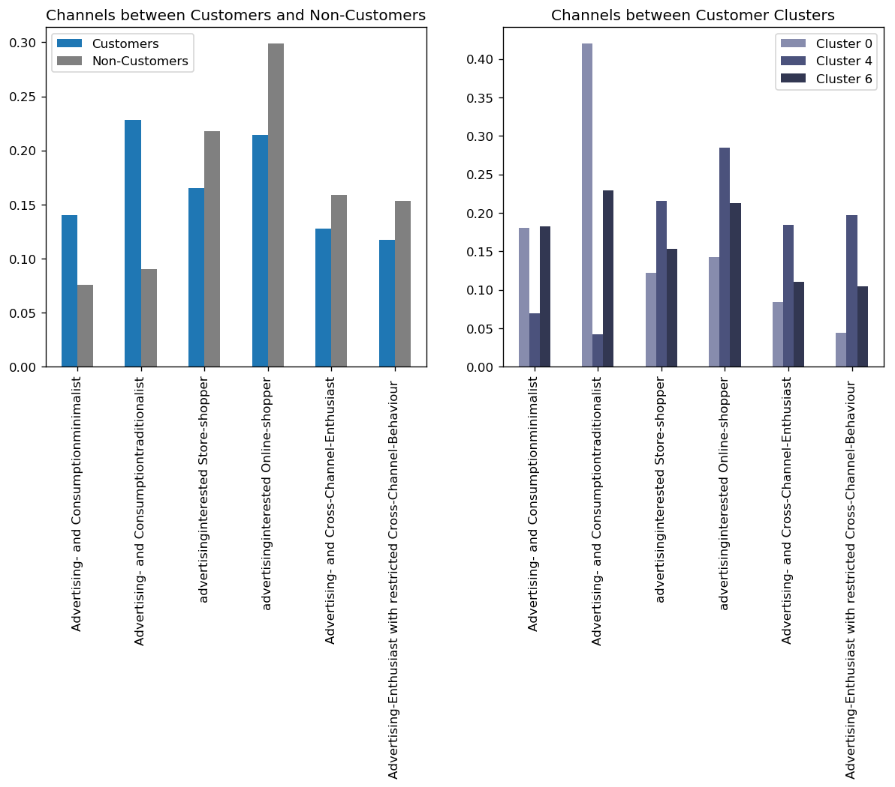

### Customer and Non-Customers

We can see than customers exceed non-customers in percentages of advertising and consumption minamilists and traditionalists, while non-customers tend to be more open in that spectrum.

### Customer Clusters

Since cluster 0 mostly represents elderly individuals, it's expected that they will be over represented in the minimalists and traditionlists. And also since cluster 4 represents the younger customers, we don't see alot of them as minimalist and traditionalists. And finally we can see that cluster 6 has the most uniform distribtution across the spectrum.

## Financial Type

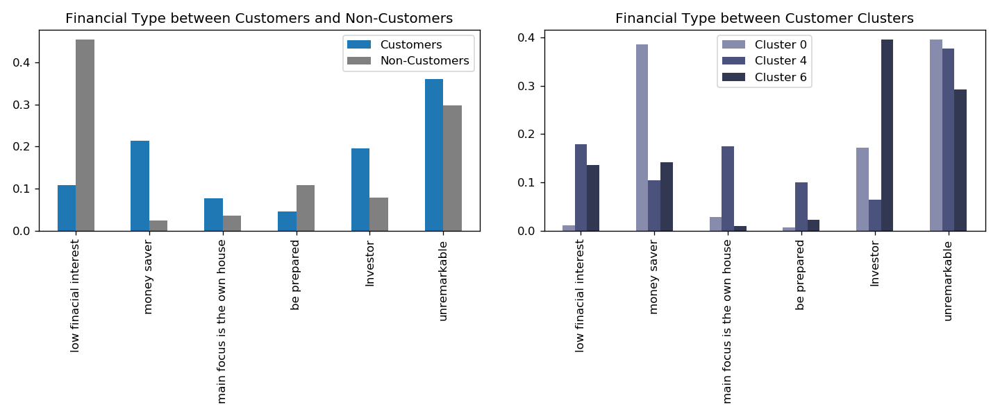

## Customers and Non-Customers

20% of customers are money savers, while another 20% are inverstors, and around 35% are unremarkable which I guess means that they have no specific financial type. On the other hand, non-customers tend to have low financial interest.

## Customer Clusters

We can that the majority of cluster 0 with distinguished financial type are money savers, while in cluster 6 they are investors. Cluster 4 doesn't show a specific type.

## Life Stage

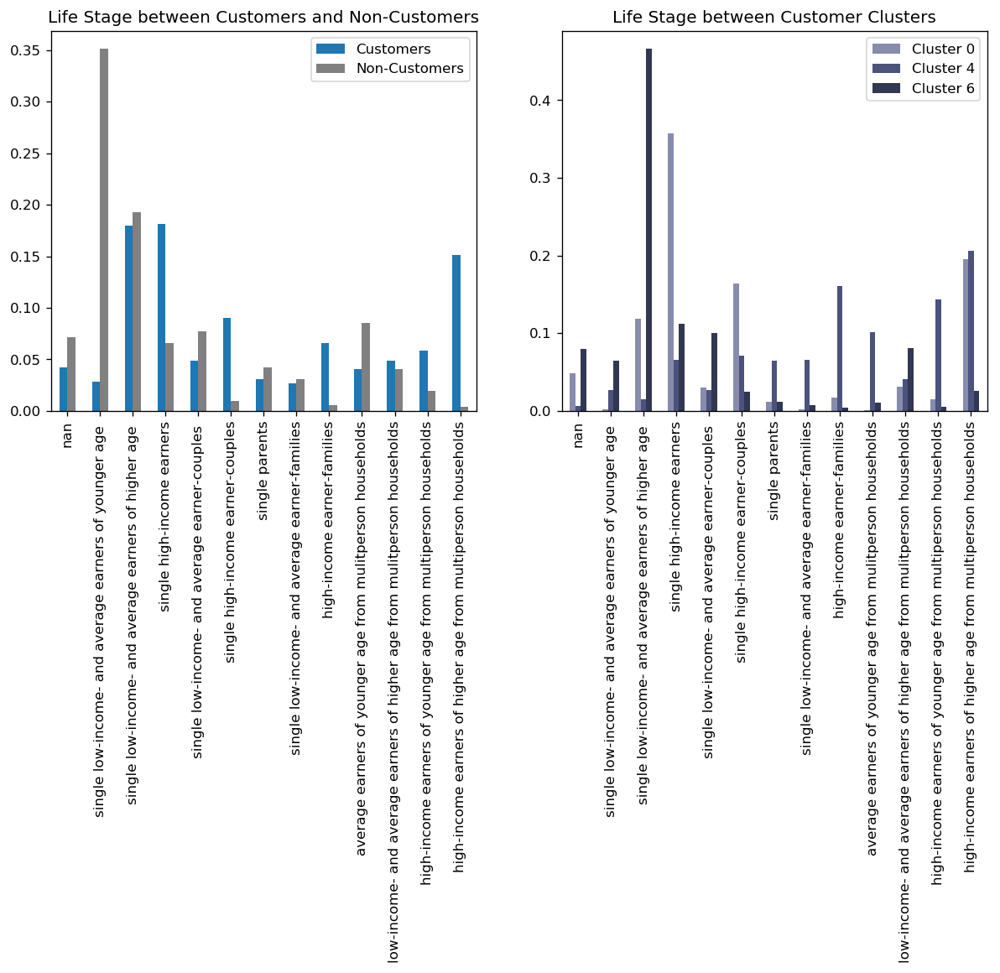

## Customers and Non-Customers

The most frequent non-customer type is single low-income and average earners of younger age, while customers' most frequent type is singe high-income earner. However, there is no great difference between the most frequent value of customers and two next most frequent values, indicating the difference between clusters.

## Customer Clusters

Around 70% of cluster 6 are single, with the majority of them being single low-income average earners of higher age., while the most frequent type in cluster 0 is single high-income earners, while cluster 4's most frequent type is high income earner of higher age from multiperson households. However, the remaining majority of cluster 4 types falls in younger aged families with different types of income.

## Return Type

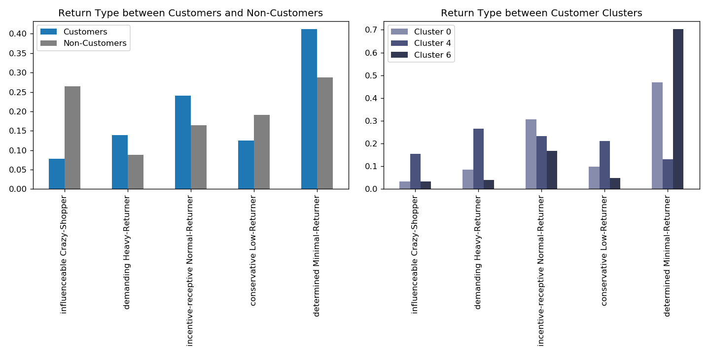

## Customers and Non-Customers

The most frequent type in customers is determined minimal returner, which I think means that these individuals aren't the shopping type. They only buy what they need when they need it. The second frequent type in incentive receptive normal returner. While in non-customers, we can see that the most frequent type is influencable crazy shopper, and these wouldn't definetly be interested in mail-order cataloges.

## Customers Clusters

First off we can see the cluster 0 and 6 are the only populating most of the customers belonging to the determined minimal returner category, and that makes sense since they are older individuals, and we have found that they are consumption minimalists and traditionalists. On the other hand, cluster 4 populates every other category with frequency higher than the determined minmal returner one, with them most frequent being demanding heavy returner.

## Main Age within Household


## Customers and Non-Customers

We have already investigated the age difference between customers and non-customers, and we can see that the main age within the household is also different between the two groups, where customers households tend be also older in age, while non-customers households tend to be younger.

## Customer Clusters

We can see that cluster 4 is the main cluster populating younger ages in customers clusters, while cluster 0 and 6 have nearly identical distributions representing the elderly segments of the customers.

## Estimated Net Household Income


## Customers and Non-Customers

We can see a huge difference between the distribution of customers and non-customers among estimated net household income, where more than 50% of non-customers come from very low income households, and only around 15% of customers do. The most frequent in customers is average income, and the second most is lower income. However, the total percentage of customers whose income is average or above exceeds 50%.

## Customers Clusters

Now we can see a difference between the two older segments, which are cluster 0 and 6. We can see that over 60% of cluster 6 households have either lower or very low income, while more than 70% of cluster 0 has average or higher income. Similarily cluster 4 also has around 70% of it's households having average or higher income.

### **Does this mean that cluster 6 is poorer than cluster 0?**

Will that would be the case if this feature indicated the income of the individual, however since this feature indicates the net household income, this doesn't say anything about the specific individuals in cluster 0 and 6. Since cluster 6 had more tendency to be single, it makes sense that cluster 0 household income would be higher, because if cluster 0 is financially above average, it's safe to say that probably the rest of their family is the same, and that would make their net income larger than the same individual if he was single, and that's the situation for cluster 6.

## Neighborhood Area

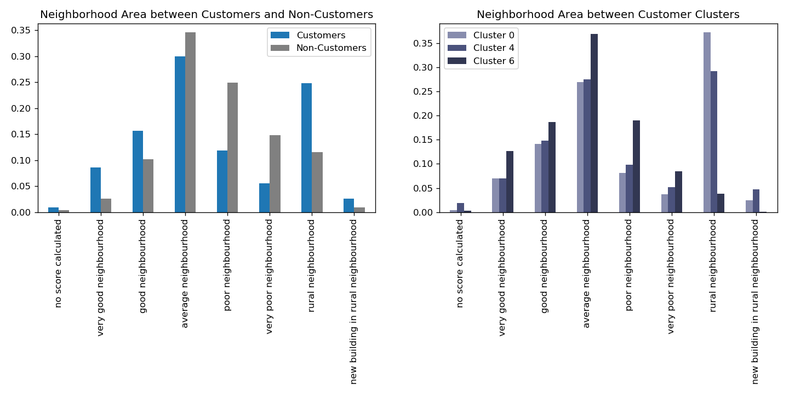

## Customers and Non-Customers

The most frequent neighborhood area in both customers and non-customers is average neighborhoods, however the next most frequent for customers is rural neighborhoods, while that of non-customers is poor neighboorhoods. We can also see that the percentage of customers occupying above average neighborhood areas is larger than non-customers'.

## Customers Clusters

We can see that our remark about the household income difference between cluster 0 and 6 has been useful, because cluster 6 to have the highest percentage occupying average and above neighborhood areas, while the most frequent neighborhood area for cluster 0 is rural areas, since they are mostly families. Cluster 4 is extremely similar to cluster 0 in this attribute.

## Moving Patterns


## Customers and Non-Customers

50% of customers are classified as having low or very mobility, while more than 60% of non-customers are the extreme opposite, with classification of either high or very high mobility.

## Customers Clusters

Once again we can see some of the differing factors between cluster 0 and 6, since cluster 6 are mostly single individuals, more than 60% of their moving pattern is high or very high and 25% have middle mobility. On the other hand, since cluster 0 and 4 tend to in families, their mobility is much lower than cluster 6, with almost 75% of cluster 0 having low or very low mobility, and 65% of cluster 4 having the same.

Now that I solidly understood the customer base through the previous analysis, I proceed to the next part.

## Campaign Prediction

As I previously said, in this part we are supposed to make a supervised learning model based on campaign data provided in `Udacity_MAILOUT_052018_TRAIN.csv` which hold demographic data for individuals targeted in marketing campaigns paired with whether they have became customers or not.

Since I already had a cleaning pipeline for the previous datasets, all I needed to do was to check whether this dataset conforms to what we already know in terms of null percentages in features.

```python
# Read mailout training data
mailout_train = pd.read_csv('../../data/Term2/capstone/arvato_data/Udacity_MAILOUT_052018_TRAIN.csv', sep=';')

# Replace unknown values with null
mailout_train_new = replace_unknown_with_null(mailout_train)

# Check null percentages in columns and rows
fig = plt.figure(figsize=(14, 4))

plt.subplot(1, 2, 1)
plt.title("Null Percentages in Columns")
mailout_null_columns = get_null_prop(mailout_train_new, axis=0, plot=True)

plt.subplot(1, 2, 2)
plt.title("Null Percentages in Rows")
mailout_null_rows = get_null_prop(mailout_train_new, axis=1, plot=True)
```

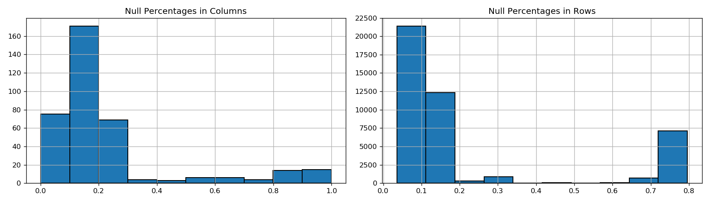

The null percentages somehow conform to the what we saw in `AZDIAS` and `CUSTOMERS` , so I proceeded with cleaning them using the cleaning function, then checking whether they have features that weren't dropped compared to `clean_azdias` .

```python
# Test cleaning the dataset using cleaning function
mailout_train_clean = clean_dataset(mailout_train_new)

print("Shape before cleaning:", mailout_train.shape)
print("Shape after cleaning:", mailout_train_clean.shape)

# Check if feature set is the same as clean AZDIAS
set(mailout_train_clean.columns) == set(clean_azdias.columns)
```

```markdown
Shape before cleaning: (42962, 367)
Shape after cleaning: (35093, 361)

False
```

```python
# Check for difference in features in both datasets
print("Features in clean MAILOUT not in clean AZDIAS:", set(mailout_train_clean.columns).difference(clean_azdias.columns))
print("Features in clean AZDIAS not in clean MAILOUT:", set(clean_azdias.columns).difference(mailout_train_clean.columns))
```

```markdown
Features in clean MAILOUT not in clean AZDIAS: {'AGER_TYP', 'D19_SONSTIGE', 'D19_VOLLSORTIMENT', 'EXTSEL992', 'VHA', 'RESPONSE', 'D19_BUCH_CD', 'D19_SOZIALES'}
Features in clean AZDIAS not in clean MAILOUT: {'KBA13_ANTG4'}
```

So there are some features that we have in `MAILOUT` that weren't dropped, so if we opted to use these there are some points that we need to take care of:

1. They aren't included in imputation pipeline
2. They aren't included in scaling pipeline
3. They aren't included in PCA transformer
4. They aren't included in clustering algorithm

So they could be concatenated with the results of the original pipeline and cleaned separately if I wanted to use them, or we could just drop them.

Since at that moment, my main goal was to make a baseline to build upon, I didn't to use the previous customer segmentation pipeline at all, and all I need was clean data to pass to a supervised machine learning algorithm. So I left them as they are.

I added the feature `KBA13_ANTG4` that was dropped during cleaning so that we are able to use the customer segmentation pipeline if we needed.

```python
mailout_train_clean = clean_dataset(mailout_train_new, keep_features=["KBA13_ANTG4"])

```

After that I need to see these features that we didn't include in the customer segmentation, and I also needed to look at the `RESPONSE` target feature to see how it is distributed.

```python
new_feats = ['D19_BUCH_CD', 'VHA', 'EXTSEL992', 'D19_SOZIALES',
             'D19_VOLLSORTIMENT', 'RESPONSE', 'AGER_TYP', 'D19_SONSTIGE']

mailout_train_clean[new_feats].hist(figsize=(14, 14));
```


All of the features shall be imputed using mean values since all of their missing percentages exceed 10%.

```markdown
D19_BUCH_CD          0.427863
VHA                  0.447326
EXTSEL992            0.247884
D19_SOZIALES         0.282592
D19_VOLLSORTIMENT    0.378623
RESPONSE             0.000000
AGER_TYP             0.305047
D19_SONSTIGE         0.228963
dtype: float64
```

However, I have noticed that `RESPONSE` is extremely imbalanced, which means that results of the regular baseline will probably be really bad, and we'll have to use certain techniques to handle that situation.

```python
# Impute clean AZDIAS features using old imputer
mailout_train_clean.loc[:, clean_azdias.columns] = imputer.transform(mailout_train_clean[clean_azdias.columns])

# Ad-hoc impute EXTSEL992 
mailout_train_clean["EXTSEL992"].fillna(value=mailout_train_clean["EXTSEL992"].mean(), inplace=True)

# Make new imputer for remaining features
mailout_imputer = SimpleImputer(strategy="most_frequent")

# Fit imputer and impute the remaining columns in place
mailout_train_clean.loc[:, :] = mailout_imputer.fit_transform(mailout_train_clean)

# Split training data into X and y
X = mailout_train_clean.loc[:, mailout_train_clean.columns != "RESPONSE"]
y = mailout_train_clean.loc[:, "RESPONSE"]
```

### Now that we have a clean dataset it's time to train a model

The model that I have in mind is RandomForestClassifier.

In order to evaluate this baseline, we need to have some sort of validation set in order to score our results.

For validation I'll use Stratified KFold cross validation (in order to account for RESPONSE imbalance), and I'll use sklearn's classfication report which shows recall, precision and f1-score for each label.

I'll also use ROC AUC score since it's the score of the final competition.

### The advantage of classification report is that it shows us the whole picutre, so we don't get decieved if the model is performing poorly on the under-represented class, and performing better on the over-represented one.

```python
def model_validation(model, X, y, fold_results=False, final_results=True, metric=False):
    """Evaluate model using sklearn's classification report."""
    # Instantiate StratifiedKFold 
    skf = StratifiedKFold(n_splits=3, shuffle=True, random_state=seed)

    # Make empty y_pred to fill predictions of each fold
    y_pred = np.zeros(y.shape)
    
    # Initialize empty list for scores
    scores = []

    for i, (train_idx, test_idx) in enumerate(skf.split(X, y)):
        X_train, X_test = X.iloc[train_idx], X.iloc[test_idx]
        y_train, y_test = y.iloc[train_idx], y.iloc[test_idx]

        # Fit model
        model.fit(X_train, y_train)

        # Predict fold y_test and add in y_pred
        fold_pred = model.predict(X_test)
        y_pred[test_idx] += fold_pred

        # Print classification report
        if fold_results:
            print("Fold:", i+1)
            print(classification_report(y_test, fold_pred))
        
        # Calculate fold macro f1 scores
        scores = metric(y_test, fold_pred)

    # Print final classification report
    if final_results:
        print("Final Report:")
        print(classification_report(y, y_pred))
    
    # Return metric scores if passed to the function
    if metric != None:
        return scores
```

```python
from imblearn.ensemble import BalancedRandomForestClassifier

model_validation(BalancedRandomForestClassifier(n_estimators=1000, random_state=seed), X, y)
```

```markdown
Final Report:
              precision    recall  f1-score   support

         0.0       1.00      0.69      0.81     34658
         1.0       0.03      0.73      0.06       436

    accuracy                           0.69     35094
   macro avg       0.51      0.71      0.44     35094
weighted avg       0.98      0.69      0.81     35094

Metric Score: 0.7085381814866175
```

We can see that this model still doesn't have amazing performance, but it's significantly better than the regular RandomForestClassifier.

```markdown

Final Report:
              precision    recall  f1-score   support

         0.0       0.99      1.00      0.99     34658
         1.0       0.00      0.00      0.00       436

    accuracy                           0.99     35094
   macro avg       0.49      0.50      0.50     35094
weighted avg       0.98      0.99      0.98     35094

Metric Score: 0.5
```

We can see that if we use the weighted average of any of the 3 metric used (precision, recall or f1-score) that the RandomForestClassifier wins, however, if we look into the metrics for the responsive class, we can see that the classifier completely missed them, and due to their lower percentage the classifier decided that the best strategy is to predict that all of the data points were non-responsive.

So as we can see, the best thing about classification_report is that it gives us a variety of metrics that we can use to judge our model.

## Baseline Results

We can see that this model still has bad performance, but it's siginifcantly better than the regular RandomForestClassifier.

The best thing about classification_report is that it gives us a variety of metrics that we can use to judge our model.

### But how should we judge our model?

That depends on margin of error that we are willing to except with our model. So for example, we might want a model that is able to predict all individuals likely to be customers, despite predicting a large sum of individuals that won't be customers. **In this case we'd want a model with higher Recall**.

On the other hand, sending out to a huge mass might be expensive and counter-intuitive business-wise in some case. **In this case we'd want a model with higher Precision**.

In order to get the best of both worlds, **we can use the F1-Score**, which calculate a harmonic average of Recall and Precision, penalizing a model that has bad scores for either one of the metrics.

**Personally I prefer using F1-Score, specifically the macro-averaged F1-Score**, which calculate the average of F1-Score for each class regardless the number of data points belonging to that class, as a weighted average F1-Score wouldn't account the main class we are concerned with predicting due to it's extremely low number.

It also looks like ROC AUC Macro is identical to Recall Macro, so we can use Recall as a proxy for ROC AUC instead of calculating it twice.

I think that getting a model with high precision with this dataset would be a stretch, so my best guess right now is to use Recall, but the other metric to avoid a model with really bad precision.

### Therefore, we can see the results are:

1. *Recall* (Macro): 0.71
2. *Precision* (Macro): 0.51
3. *F1-Score* (Macro): 0.44

### The first imporvement that we can make is to utilize the dimensionality reduction that we have made earlier.

1. Select only features in clean_azdias
2. Scale the features and reduce dimensions using PCA
3. Predict using PCA

## Predicting using PCA reduced dataset

```python
# Filter for features used in clean_azdias
mailout_train_pre_pca = mailout_train_clean[clean_azdias.columns]

# Scale the features
mailout_train_pre_pca = scaler.transform(mailout_train_pre_pca)

# Reduce dimensions using pca to d dimensions
X = pd.DataFrame(pca.transform(mailout_train_pre_pca)[:, :d])

model_validation(BalancedRandomForestClassifier(random_state=seed))
```

```markdown
Final Report:
              precision    recall  f1-score   support

         0.0       0.99      0.59      0.74     34658
         1.0       0.02      0.58      0.03       436

    accuracy                           0.59     35094
   macro avg       0.50      0.58      0.39     35094
weighted avg       0.98      0.59      0.73     35094

Metric Score: 0.5825897065477098
```

The results of PCA transformed training set with BalancedRandomForestClassifier is worse than using the vanilla dataset.

### Could these results be improved with other algorithms?

We could spot-check multiple algorithms to prove if this is the case.

Instead of implementing under-sampling or over-sampling in 
validation, we can use BalancedBaggingClassifier to wrap the 
classfication algortithms that we are interested in using. But we'll 
need to scale the data because algorithms like Logistic Regression, KNN 
and SVM can perform better after scaling the data.

### Note that when comparing different models result, I'll not increase
n_estimators to save time, as the results are just for comparison.

```python
def evaluate_models(models_dict, X, y, scoring="recallWe can see that these features have definetly improved upon our PCA results, and even made it better than the original dataset score.
Right now what if we add the PCA features to all features?_macro"):
    """Evaluate several models using sklearn's cross_val_score."""
    model_scores = {}
    for name, model in models_dict.items():
        skf = StratifiedKFold(n_splits=3, shuffle=True, random_state=seed)
        scores = cross_val_score(model, X, y, cv=skf, scoring=scoring)
        model_scores[name] = scores
        print("Model:%s, Score:%.3f (+/- %.3f)" % (name, np.mean(scores), np.std(scores)))
    return model_scores
```

Then I selected the models we were going to use and passed them into the function to see how they fare against RandomForests.

```python
from sklearn.model_selection import cross_val_score
from imblearn.ensemble import BalancedBaggingClassifier
from sklearn.linear_model import LogisticRegression
from sklearn.neighbors import KNeighborsClassifier
from sklearn.svm import SVC
from sklearn.pipeline import Pipeline
from sklearn.preprocessing import StandardScaler

bagging_model = lambda model: BalancedBaggingClassifier(model)

models = {"RF": BalancedRandomForestClassifier(random_state=seed),
          "LR": bagging_model(LogisticRegression(max_iter=1000, random_state=seed)),
          "KNN": bagging_model(KNeighborsClassifier()),
          "Linear SVM": bagging_model(SVC(kernel="linear", random_state=seed)),
          "RBF SVM": bagging_model(SVC(kernel="rbf", random_state=seed))}

pca_bagging_scores = evaluate_models(models, X, y, "recall_macro")
```

```markdown
Model:RF, Score:0.549 (+/- 0.026)
Model:LR, Score:0.558 (+/- 0.006)
Model:KNN, Score:0.539 (+/- 0.023)
Model:Linear SVM, Score:0.536 (+/- 0.009)
Model:RBF SVM, Score:0.571 (+/- 0.016)
```

We can see 
that Bagging using LogisitcRegression and RBF SVM exceeded the recall of
 BalancedRandomForestClassifier. However we have to note that we didn't 
increase the number of estimators, and we still don't know the exact 
recall of the responsive class.

### What if we trained them on the original data?

But we'll need to scale the data because algorithms like Logistic 
Regression, KNN and SVM can perform better after scaling the data.

```python
# Split training data into X and y
X = mailout_train_clean.loc[:, mailout_train_clean.columns != "RESPONSE"]
y = mailout_train_clean.loc[:, "RESPONSE"]

scaled_pipeline = lambda model: make_pipeline(StandardScaler(), model)

models = {"RF": BalancedRandomForestClassifier(random_state=seed),
          "LR": scaled_pipeline(bagging_model(LogisticRegression(max_iter=1000, random_state=seed))),
          "KNN": scaled_pipeline(bagging_model(KNeighborsClassifier())),
          "Linear SVM": scaled_pipeline(bagging_model(SVC(kernel="linear", random_state=seed))),
          "RBF SVM": scaled_pipeline(bagging_model(SVC(kernel="rbf", random_state=seed)))}

original_bagging_scores = evaluate_models(models, X, y, "recall_macro")
```

```markdown
Model:RF, Score:0.673 (+/- 0.013)
Model:LR, Score:0.585 (+/- 0.016)
Model:KNN, Score:0.533 (+/- 0.028)
Model:Linear SVM, Score:0.576 (+/- 0.013)
Model:RBF SVM, Score:0.573 (+/- 0.006)
```

By comparing the results, we can see that all of the algorithms (except 
Bagged KNN) perform better using the original data. However the 
improvement in all of them compared to BalancedRandomForestClassifier is
 tiny, so we need not continue in exploring them.

In terms of the significant improvement in BalancedRandomForestClassifier, this could be for two reasons:

1. The features that aren't included in the PCA could add important information to the model
2. The PCA transformed data isn't particularly good for the task that we need

### We can test this by adding all of the features that were left our from PCA transformation to the transformed data to test the performance of the
algorithm again.

```python
# Make new dataframe with only new feats
mailout_train_new_feats = mailout_train_clean.loc[:, new_feats]

# Concatenate PCA transformed dataframe with new feats dataframe
X = pd.concat([pd.DataFrame(pca.transform(mailout_train_pre_pca)[:, :d]), mailout_train_new_feats.reset_index(drop=True)], axis=1)

# Drop RESPONSE
X = X.drop(columns=["RESPONSE"])

model_validation(BalancedRandomForestClassifier(n_estimators=1000, random_state=seed), X, y)
```

```markdown
inal Report:
              precision    recall  f1-score   support

         0.0       1.00      0.70      0.82     34658
         1.0       0.03      0.74      0.06       436

    accuracy                           0.70     35094
   macro avg       0.51      0.72      0.44     35094
weighted avg       0.98      0.70      0.81     35094

Metric Score: 0.7209044081958259
```

We can see that these features have definetly improved upon our PCA 
results, and even made it better than the original dataset score.

### Right now what if we add the PCA features to all features?

```python
# Concatenate PCA transformed dataframe with new feats dataframe
X = pd.concat([pd.DataFrame(pca.transform(mailout_train_pre_pca)[:, :d]), mailout_train_clean.reset_index(drop=True)], axis=1)

# Drop RESPONSE
X = X.drop(columns=["RESPONSE"])

model_validation(BalancedRandomForestClassifier(n_estimators=1000, random_state=seed), X, y)
```

```markdown
Final Report:
              precision    recall  f1-score   support

         0.0       0.99      0.67      0.80     34658
         1.0       0.03      0.72      0.05       436

    accuracy                           0.67     35094
   macro avg       0.51      0.70      0.43     35094
weighted avg       0.98      0.67      0.79     35094

Metric Score: 0.6977696440858011
```

We can see that this has worsened the results. It seems that the PCA transformer 
features are able to provide info that is better than the original 
features before transformation, and the presence of both at the same 
time doesn't improve the model performance at all.

### What if we add the clusters distances as features to PCA features + new features combo?

```python
# transform mailout train data using PCA
mailout_train_pca = pd.DataFrame(pca.transform(mailout_train_pre_pca)[:, :d], 
                                 columns=[f"pca_{i}" for i in range(d)])

# predict mailout cluster distances
mailout_distances = pd.DataFrame(kmeans.transform(mailout_train_pca),
                                 columns=[f"cluster_{i}" for i in range(kmeans.cluster_centers_.shape[0])])

# predict mailout cluster
mailout_clusters = pd.Series(kmeans.predict(mailout_train_pca), name='label')

# visualize mailout clusters
mailout_clusters.value_counts().plot(kind="bar", title="How Are Clusters Distributed in MAILOUT Data?");
```

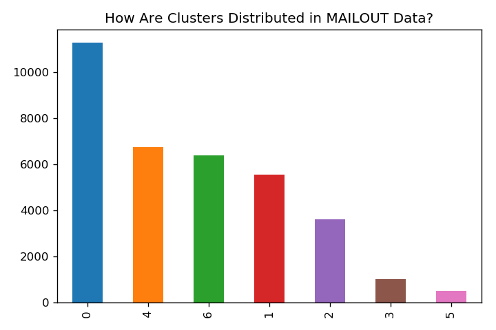

If we were to use these clusters directly, we would predict that the majority of the individuals in the `MAILOUT` data would respond, but we know from the labels than only a very small portion of them actually responded.

```python
# concatenate cluster labels to the clean dataset
X = pd.concat([mailout_train_pca, mailout_train_new_feats.reset_index(drop=True), mailout_distances], axis=1)

# drop RESPONSE
X = X.drop(columns=["RESPONSE"])

model_validation(BalancedRandomForestClassifier(n_estimators=1000, random_state=seed), X, y)
```

```markdown
Final Report:
              precision    recall  f1-score   support

         0.0       0.99      0.69      0.81     34658
         1.0       0.03      0.72      0.05       436

    accuracy                           0.69     35094
   macro avg       0.51      0.70      0.43     35094
weighted avg       0.98      0.69      0.80     35094

Metric Score: 0.7035868915429383
```

The results are worse than just using PCA features and new features.

### What is we just use cluster distances and new features?

```python
# concatenate cluster labels to the clean dataset
X = pd.concat([mailout_train_new_feats.reset_index(drop=True), mailout_distances], axis=1)

# drop RESPONSE
X = X.drop(columns=["RESPONSE"])

model_validation(BalancedRandomForestClassifier(n_estimators=1000, random_state=seed), X, y)
```

```markdown
Final Report:
              precision    recall  f1-score   support

         0.0       1.00      0.68      0.81     34658
         1.0       0.03      0.82      0.06       436

    accuracy                           0.68     35094
   macro avg       0.51      0.75      0.43     35094
weighted avg       0.98      0.68      0.80     35094

Metric Score: 0.7474211491200037
```

I want to go more in depth with SupportVectorMachines, and look into their classification report with the original data.

We
 can see that the results have significantly improved, which indicates 
that the presence of all original features isn't useful for the model.

### So we might want to test automatic feature selection to see if we can
still use some of them and the PCA features to imporve the final
results.

### Automatic Feature Selection

There are several methods present in scikit-learn for feature selection, but I'll use **SelectKBest** which removes all but the highest scoring K features.

### Let's just test SelectKBest on all of the features we had so far to see if it can get better results that our best trial so far (Recall 0.74)

```python
# Concatenate all features
X = pd.concat([mailout_train_pca, mailout_train_clean.reset_index(drop=True), mailout_distances, mailout_clusters], axis=1)

# Drop RESPONSE
X = X.drop(columns=["RESPONSE"])

for k in [10, 30, 50, 100, 300, 500]:
    print("K:", k)
    
    # make pipeline
    pipeline = make_pipeline(SelectKBest(k=k),
                             BalancedRandomForestClassifier(n_estimators=1000, random_state=seed))
    
    model_validation(pipeline, X, y)
    print()
```

```markdown
K: 10
Final Report:
              precision    recall  f1-score   support

         0.0       1.00      0.70      0.83     34657
         1.0       0.03      0.83      0.07       436

    accuracy                           0.71     35093
   macro avg       0.52      0.77      0.45     35093
weighted avg       0.99      0.71      0.82     35093

Metric Score: 0.7671317445321728

K: 30
Final Report:
              precision    recall  f1-score   support

         0.0       1.00      0.71      0.83     34657
         1.0       0.03      0.82      0.07       436

    accuracy                           0.71     35093
   macro avg       0.52      0.76      0.45     35093
weighted avg       0.98      0.71      0.82     35093

Metric Score: 0.7620556696904557

K: 50
Final Report:
              precision    recall  f1-score   support

         0.0       1.00      0.71      0.83     34657
         1.0       0.03      0.80      0.06       436

    accuracy                           0.71     35093
   macro avg       0.51      0.75      0.45     35093
weighted avg       0.98      0.71      0.82     35093

Metric Score: 0.7526066873716092

K: 100
Final Report:
              precision    recall  f1-score   support

         0.0       1.00      0.71      0.83     34657
         1.0       0.03      0.79      0.06       436

    accuracy                           0.71     35093
   macro avg       0.51      0.75      0.45     35093
weighted avg       0.98      0.71      0.82     35093

Metric Score: 0.7497644021549252

K: 300
Final Report:
              precision    recall  f1-score   support

         0.0       1.00      0.70      0.83     34657
         1.0       0.03      0.77      0.06       436

    accuracy                           0.71     35093
   macro avg       0.51      0.74      0.44     35093
weighted avg       0.98      0.71      0.82     35093

Metric Score: 0.7353716289811935

K: 500
Final Report:
              precision    recall  f1-score   support

         0.0       1.00      0.70      0.82     34657
         1.0       0.03      0.79      0.06       436

    accuracy                           0.70     35093
   macro avg       0.51      0.74      0.44     35093
weighted avg       0.98      0.70      0.81     35093

Metric Score: 0.744009369775735
```

**We can see that selecting that using the top 10 features is enough to improve the Macro Recall to 0.77.
I'm still interested to see if we only use the feature selection on the PCA and old features only, while keeping the new feature and distances untouched.**

```python
pca_feats = list(mailout_train_pca.columns)
azdias_feats = list(clean_azdias.columns)

for k in [10, 30, 50]:
    print("K:", k)
   
    pipeline = Pipeline([
        ('feature_selection', ColumnTransformer([
            ('kbest', SelectKBest(k=k), pca_feats+azdias_feats),
        ], remainder='passthrough')),
        ('clf', BalancedRandomForestClassifier(n_estimators=1000, random_state=seed))
    ])
    
    model_validation(pipeline, X, y)
    print()
```

```markdown
K: 10
Final Report:
              precision    recall  f1-score   support

         0.0       1.00      0.70      0.82     34657
         1.0       0.03      0.83      0.06       436

    accuracy                           0.70     35093
   macro avg       0.52      0.77      0.44     35093
weighted avg       0.99      0.70      0.81     35093

Metric Score: 0.7663125665425543

K: 30
Final Report:
              precision    recall  f1-score   support

         0.0       1.00      0.70      0.83     34657
         1.0       0.03      0.82      0.06       436

    accuracy                           0.71     35093
   macro avg       0.52      0.76      0.45     35093
weighted avg       0.98      0.71      0.82     35093

Metric Score: 0.7617978118285937

K: 50
Final Report:
              precision    recall  f1-score   support

         0.0       1.00      0.71      0.83     34657
         1.0       0.03      0.81      0.06       436

    accuracy                           0.71     35093
   macro avg       0.51      0.76      0.45     35093
weighted avg       0.98      0.71      0.82     35093

Metric Score: 0.7555872211446162
```

### Now we know it's better to just pass all features for automatic feature
selection, as the performance didn't improve over the best score.[¶](https://viewqk2nn0jlef.udacity-student-workspaces.com/notebooks/Arvato%20Project%20Workbook.ipynb#Now-we-know-it's-better-to-just-pass-all-features-for-automatic-feature-selection,-as-the-performance-didn't-improve-over-the-best-score.)

Now I'll make a function to document all of the steps we did for 
preparing the dataset, so we'll be able to do the same in testing.

```python
def prepare_mailout(df, p=0.5, test=False):
    """Prepare MAILOUT training and testing dataset for ML Pipeline."""
    # Set dropping threshold to 1.0 for test set
    if test:
        p = 1.0
        
    # Clean the dataset
    df_clean = clean_dataset(df, p_row=p, p_col=p, keep_features=["KBA13_ANTG4"])
    
    # Drop RESPONSE if train set
    if test:
        y = None
    else:
        y = df_clean["RESPONSE"]
        df_clean.drop("RESPONSE", axis=1, inplace=True)
        
    # Filter features used in train set only
    if test:
        train_feats = pickle.load(open("mailout_train_feats.pkl", "rb"))
        df_clean = df_clean.loc[:, train_feats]
    else:
        train_feats = list(df_clean.columns)
        pickle.dump(train_feats, open("mailout_train_feats.pkl", "wb"))
    
    # Missing values
    # Impute clean AZDIAS features using old imputer
    azdias_imputer = pickle.load(open("imputer.pkl", "rb"))
    df_clean.loc[:, clean_azdias.columns] = azdias_imputer.transform(df_clean[clean_azdias.columns])
    
    # Impute remaning features
    if test:
        # Load mailout imputer for test set
        mailout_imputer = pickle.load(open("mailout_imputer.pkl", "rb"))
        df_clean = pd.DataFrame(mailout_imputer.transform(df_clean), columns=df_clean.columns)
    else:
        # Fit imputer for train set and pickle to load with test set
        mailout_imputer = SimpleImputer(strategy="mean")
        df_clean = pd.DataFrame(mailout_imputer.fit_transform(df_clean), columns=df_clean.columns)
        pickle.dump(mailout_imputer, open("mailout_imputer.pkl", "wb"))
    
    # PCA features
    df_pre_pca = df_clean[clean_azdias.columns]
    df_pre_pca_scaled = scaler.transform(df_pre_pca)
    df_pca = pd.DataFrame(pca.transform(df_pre_pca_scaled)[:, :d], 
                          columns=[f"pca_{i}" for i in range(d)])

    # Cluster distances
    df_distances = pd.DataFrame(kmeans.transform(df_pca),
                                columns=[f"cluster_{i}" for i in range(kmeans.cluster_centers_.shape[0])])

    # Cluster labels
    df_clusters = pd.Series(kmeans.predict(df_pca), name='label')
    
    # Concatenate all features
    X = pd.concat([df_clean, df_pca, df_distances, df_clusters], axis=1)
    
    return X, y
```

## Hyperparameter Tuning The Final Pipeline

```python
# Prepare training set
X_train, y_train = prepare_mailout(mailout_train)

pipeline = Pipeline([
    ('k_best',SelectKBest()),
    ('clf', BalancedRandomForestClassifier(random_state=seed))
])

pipeline_grid = {
    "k_best__k": [int(x) for x in np.linspace(start=5, stop=30, num=5)],
    "clf__n_estimators": [int(x) for x in np.linspace(start=1000, stop=3000, num=5)],
    "clf__max_depth": [int(x) for x in np.linspace(10, 110, num = 5)] + [None],
    "clf__min_samples_split": [2, 5, 10],
    "clf__min_samples_leaf": [1, 2, 4],
    "clf__bootstrap": [True, False],
}

combs = 1

for name, params in pipeline_grid.items():
    combs *= len(params)
    
print("Total number of combinations in parameters grid:", combs)
```

There 2700 different combinations to the hyperparamter grid that we have set. Therefore it is only logical to use randomized grid search, as we don't have the computational or time resources to find the best combination by brute force.

```python
# Instantiate StratifiedKFold object for CV
skf = StratifiedKFold(n_splits=3)

# Use RandomizedSearch to find the best hyperparameters combination
pipeline_random = RandomizedSearchCV(estimator=pipeline, param_distributions=pipeline_grid,
                                     scoring='recall_macro', n_iter=50, cv=skf, verbose=3,
                                     random_state=seed, n_jobs=-1)

# Fit the RandomizedSearch model to the training data
pipeline_random.fit(X_train.values, y_train.values)
```

### RandomizedSearchCV Results

```markdown
Best parameters found: {'k_best__k': 5, 
                        'clf__n_estimators': 2500,
                        'clf__min_samples_split': 10,
                        'clf__min_samples_leaf': 2, 
                        'clf__max_depth': 35, 
                        'clf__bootstrap': True}
```

### Checking metrics of final pipeline

```python
pipeline.set_params(**best_params)

model_validation(pipeline, X_train, y_train, final_results=True, plot_confusion=True)
```

```markdown
Final Report:
              precision    recall  f1-score   support

           0       1.00      0.70      0.82     34657
           1       0.03      0.84      0.07       436

    accuracy                           0.70     35093
   macro avg       0.52      0.77      0.44     35093
weighted avg       0.99      0.70      0.81     35093

Metric Score: 0.7696068445499852
```


The results aren't state of the art, but we can see that we are able to predict 84% of the responsive individuals, and only 30% of non-responsive ones are false positives.

Comparing the results to the baseline model, the Macro Recall has improved by 8.62%

### Tuning The Decision Boundary

Now the final the thing that we can do is to tune the decision boundary to get the best results that we can get using this model. In order to do this, we need to predict the probability of classes first.

```python
skf = StratifiedKFold(n_splits=3, shuffle=True, random_state=seed)

# Make empty y_pred to fill predictions of each fold
y_pred = np.zeros((y_train.shape[0], 2))

for i, (train_idx, test_idx) in enumerate(skf.split(X_train, y_train)):
    X_tr, X_test = X_train.iloc[train_idx], X_train.iloc[test_idx]
    y_tr, y_test = y_train.iloc[train_idx], y_train.iloc[test_idx]

    # Make copy of model
    model_clone = clone(pipeline)

    # Fit model
    model_clone.fit(X_tr, y_tr)

    # Predict fold y_test and add in y_pred
    fold_pred = model_clone.predict_proba(X_test)
    y_pred[test_idx, :] += fold_pred

threshs = np.linspace(0, 1, 100)
f1_scores = []
recall_scores = []
precision_scores = []

for thresh in threshs:
    thresh_pred = (y_pred[:, 1] > thresh).astype(int)
    f1_scores.append(f1_score(y_train, thresh_pred, average="macro"))
    recall_scores.append(recall_score(y_train, thresh_pred, average="macro"))
    precision_scores.append(precision_score(y_train, thresh_pred, average="macro", zero_division=1))
    
best_recall_thresh = threshs[np.argmax(recall_scores)]
print("Threshold optimizing Recall: {:.3f}".format(best_recall_thresh))
```

```markdown
Threshold optimizing Recall: 0.516
```


We can see that the best threshold slightly improved the precision of the model, by decreasing the number of false positives from 10327 to 10283.

## Final Remarks

In each step we have done in the pipeline so far, there must have been other ways we could have achieved the same or even better results. But speaking from a business perspective, if this dataset provided the data one previous campaign were the conversion rate was minute as seen, using this model which isn't particularly state of the art, would definitely decrease the costs and increase the conversion rate of the campaign due to the increased selectivity.

And now we can train the final model to predict the test set.

## Training Final Model

```markdown
pipeline.set_params(**best_params)
pipeline.fit(X_train, y_train)
```

## Test Set Prediction

```python
# Reading test set
mailout_test = pd.read_csv('../../data/Term2/capstone/arvato_data/Udacity_MAILOUT_052018_TEST.csv', sep=';')

# Copying LNR column for Kaggle submission csv file
test_LNR = mailout_test['LNR']

# Data Preparation
X_test, _ = prepare_mailout(mailout_test, test=True)

# Prediction
test_preds = pipeline.predict_proba(X_test)

# Kaggle csv submission
submission = pd.DataFrame({'LNR':test_LNR.astype(np.int32), 'RESPONSE':test_preds[:, 1]})
submission.to_csv('kaggle.csv', index=False)
```

## Conclusion

To summarize what we have done in the project so far:

1. We explored the general population dataset to understand how it should be cleaned for our analysis
2. We made a pipeline for cleaning the general population dataset and any dataset that has a similar structure
3. We performed dimensionality reduction on the general population dataset followed by a clustering analysis of the population
4. We cleaned the customers' dataset using the pipeline we previously made and analyzed the clusters' representation of the business's customer base
5. We analyzed the characteristics of our customer base and how they differ from non-customers
6. We analyzed the differences between different clusters in the customer base
7. We explored the `MAILOUT` dataset and made a pipeline to prepare the dataset for the supervised learning task
8. We analyzed different algorithms and metrics then selected the best ones that suited the situation of the dataset we have which was Balanced Random Forests for the algorithm and Macro Recall for metric which deals with the target class imbalance
9. We tested using feature selection in the pipeline to improve the results and found that it had indeed improved it
10. We made a final pipeline and tuned it's hyperparameters to predict individuals with high probability responding the mail-out campaign

## Reflection

Cleaning the general population dataset was really challenging for me, as it was the first time I've ever dealt with dataset this size, and I didn't know where to begin in exploring it.

This has forced me to find some methods to be able to digest the data in smaller portions to get a general idea about how it should be dealt with, like to into categories separately.

Also, I really enjoyed the customer segmentation part, even though it could be improved since we only tried reducing dimensionality using PCA and clustered using K-Means, where we could have used different algorithms for clustering such as DBSCAN, Agglomerative Clustering or Gaussian Mixture Models.

Anyways I have learnt much through out this project and the Nano-degree in general, and I hope that you have enjoyed my capstone project's write up. 

### Thanks for reading.
